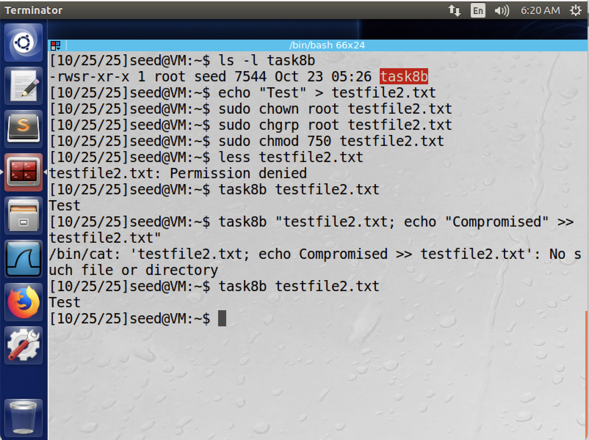

# CIS 751 Lab Assignment 1

## Task 1
We can view, set, and unset shell and environment variables as shown in Figure 1. In addition to the `printenv` command, we can also use `grep` as follows (pipe the result of `env` which prints all environment variables to `grep`):
```sh
env | grep "LOGNAME"
```

To create a new shell variable we do the following:
```sh
VAR_NAME=value
```

To create a new environment variable we simply need to export it:
```sh
export VAR_NAME=value
```

Finally, to remove a shell or environment variable we can `unset` it:
```sh
unset VAR_NAME
```


## Task 2
When a new process is forked, the child inherite all environment variables from it's parent. This is shown in Figure 2. The program `a.out` prints all environment variables of the child process, and `b.out` prints all environment variables of the parent process. We save these outputs into two files: `child` for the child process environment variables and `parent` for the parent process environment variables. Using the `diff` command we observe that all environment variables in the parent process are inherited by the child. The variable `_=a.out` or `_=b.out` is the path name of the command being executed. Since we use different programs to print the child/parent process environment variables, this is different.


## Task 3
Initially, the program called `execve()` in the following way:
```c
execve("/usr/bin/env", argv, NULL);
```

As stated in the lab, `execve()` does not create a new process. Instead, the calling process's text, data, bss, and stack are overwritten by the loaded program. Thus, the `execve` function receives it's environment variables from the caller. As described in the documentation, the signature for `execve` is:
```c
int execve(const char *filename, char *const argv[], char *const envp[]);
```

Where `envp` are environment variables passed by the caller.

The initial program called
```c
execve("/usr/bin/env", argv, NULL);
```

Which passes `NULL` for the environment variables. As seen in Figure 3, this results in nothing being printed when `/usr/bin/env` is called because there are no environment variables.

The updated program called
```c
execve("/usr/bin/env", argv, environ);
```

Which passes the environment variables in `environ` (the parent's environment variables) to the new program. We observe that the parent's environment variables are correctly passed to the new program and thus printed when `/usr/bin/env` is called.


## Task 4
Unlike `execve()`, `system()` inherits it's environment variables from it's parent. When `system()` spawns a new shell to execute the `env` command, we expect `env` to run in an environment that contains all of the parent process's environment variables. As expected, these are printed when the following program is run:
```c
#include <stdio.h>
#include <stdlib.h>

int main()
{
    system("/usr/bin/env");
    return 0;
}
```


## Task 5
To set this up, the following environment variables were created (or modified) by the seed user:
```sh
export PATH = my_path:$PATH
export MY_VAR=foo
export LD_LIBRARY_PATH=my_linker_path
```
And also make the `task5` program a Set-UID program owned by root.
```sh
sudo chown root task5
sudo chmod 4755 task5
```

The program was then run and output was put in `task5_output`. The resulting file was then searched using 
```sh
grep <VARIABLE> task5_output
```
Figure 5 shows the output of this. As is evident, the `MY_VAR` and `PATH` variables were inherited by the child process, and are thus present in the output file (output of first two `grep` commands). However, the `LD_LIBRARY_PATH` variable is not present. This is a security feature where certain environment variables are not passed to the child if it is created in a Set-UID context.


We can test this by removing the Set-UID bit (`sudo chmod 755 task5`) and re-running the experiment. As is shown in Figure 6, the `LD_LIBRARY_PATH` variable is inherited by the child.


Or more simply, we can use the `diff` command to examine differences between the two files. From this, we can see that neither the `LD_LIBRARY_PATH` and `LD_PRELOAD` environment variables were passed to the child process in the Set-UID program.


## Task 6
In this exercise, we will exploit the program calling `ls` and use it to generate a root shell. As described in the lab, we first need to setup the following symbolic link:
```sh
$ sudo rm /bin/sh
$ sudo ln -s /bin/zsh /bin/sh
```

The `PATH` variable is updated to contain the current directory and exported as follows:
```sh
export PATH=.:$PATH
```

We then compile the following program with the name `ls` in the current directory.
```c
#include <stdio.h>
#include <stdlib.h>

int main()
{
    printf("I am a malicious version of ls!!!!\n");
    printf("I will now spawn a root shell!\n");
    system("/bin/sh");
    return 0;
}
```

*Note that the task6 program was given the owner root and the set UID bit.*

As is shown in Figure 8, we get a root shell when the task6 program is run. This occurs because the system will search the directories described in `PATH` to find the `ls` command when run. Since our directory preceeds everything else, it will find a match to our version of `ls` and execute that, spawning a shell in a Set UID context.

*Observe that once we set the PATH variable to include the directory containing the ls program, we will get a shell if we use the `ls` command. However, because this was not done with escalated privileges, this is a shell for the current user and is of no advantage. The benefit comes from having `ls` executed in a situation where the effective user is root.*


## Task 7
In task 7, we create a malicious library containing a `sleep` function and attempt to get our program to execute the malicious function. We do this by compiling our program (shown below) as a library and adding it to `LD_PRELOAD`, so when the dynamic linker searches for `sleep`, it finds our function first.
```c
// Malicious sleep program
#include <stdio.h>
void sleep(int s)
{
    printf("I am not sleeping!\n");
}
```
We then compile this program and create a shared object.
```sh
gcc -fPIC -g -c mylib.c
gcc -shared -o libmylib.so.1.0.1 mylib.o -lc
```
And set the `LD_PRELOAD` environment variable:
```sh
export LD_PRELOAD=./libmylib.so.1.0.1
```


We first do this in a non-privileged environment (the task7 program is owned by seed and is not Set UID). As can be seen in Figure 9, when task7 is executed we see the string `"I am not sleeping"` printed, as the malicious function was executed. However, when task7 is owned by root and is a Set-UID program (the second example), we do not see this string printed and the program simply slept for a second before exiting. This is because the `LD_PRELOAD` environment variable is not passed to the new shell in a Set-UID context. This is a security feature to prevent exactly this.


Things work a little different when we execute task7 in a root account where the `LD_PRELOAD` variable was exported by root. As shown in Figure 10, our program calls the malicious `sleep()` function demonstrating that the `LD_PRELOAD` environment variable was passed to the child process despite task7 being a root-owned Set UID program.


Making the program a non-root owned Set UID program and exporing `LD_PRELOAD` in a different, non-root, account yields similar behavior to the second part shown in Task 7a. Figure 11 shows that the malicious `sleep()` function is not called, demonstrating that the `LD_PRELOAD` environment variable is not passed to the child.


From these experiments, we can make several conclusions:
1. The `LD_PRELOAD` environmental variable is inherited by the child process in a non-Set-UID context.
2. The `LD_PRELOAD` environmental variable is generally not inherited by the child process if the program is a Set-UID program.
3. Environment variables exported by the root account are always inherited by the child process. This is demonstrated in Figure 9, where the malicious `sleep()` function was called despite the program being Set-UID.

## Task 8
### Part 1
Yes, we are still able to compromise the integrity of the system. The simplest way to do this is by using command injection to exploit the user generated parameter being passed to the `system()` function. For example, we may want to add some additional data to a file that we should have readonly permissions to. Figure 12 demonstrates this by appending text data to a file that we would otherwise not have permission to read or write. By passing the input 

```sh
task8 "testfile.txt; echo "Compromised" >> testfile.txt"
```

we are able to append the string `"Compromised"` to `testfile.txt`, despite not having permissions to read or write to it. Since task8 is a Set-UID program, the `system()` command is executed with root privileges. Since root is able to read and write to `testfile.txt`, our command is successful and we can modify the file. In principle, we could create, modify, and delete any file we want through this program.


### Part 2
Now that we are using `execve()` instead of `system()` to execute the command we are no longer able to exploit the same vulnerability in the program. When we execute the same command we now receive an error (Figure 13).
```
/bin/cat: 'testfile2.txt; echo Compromised >> testfile2.txt": No such file or directory
```



Unlike before, we cannot execute arbitrary commands using command injection.

When `system()` is called it effectively executes the following:
```sh
/bin/sh -c "/bin/cat testfile.txt; echo 'Compromised' >> testfile.txt"
```

Thus, a shell is first spawned, and the input is then passed as the command for the shell to execute. The input is then parsed and two parts get executed: 1) "/bin/cat testfile.txt" and 2) echo 'Compromised' >> testfile.txt.

However, `execve()` does not spawn a new shell to execute the command. It simply directly executes the program (i.e. /bin/cat), replaces the text, data, stack, etc. in the current process, and passes the input to the command being executed. Thus, /bin/cat looks for the file `/bin/cat testfile.txt; echo 'Compromised' >> testfile.txt` which obviously doesn't exist and we get an error. Since there is no shell involved, the input is not parsed and our command injection fails.

## Task 9
In Task 9, we have a program that opens a file under standard permissions, elevates it's privilege using `setuid()`, and then forks a new process.
```c
fd = open("/etc/zzz", O_RDWR | O_APPEND);
if (fd == -1) {
    printf("Cannot open /etc/zzz\n");
    exit(0);
}

sleep(1); // Do stuff

setuid(getuid()); // Relinquishes root privileges, and getuid() returns the real UID
```

Observe that when a new process is forked, the file pointer is only cleaned up in the parent process.
```c
// Note we have relinquished root privileges at this point
if (fork()) {
    // Parent process
    close(fd);
    exit(0);
} else {
    // Child process
    // File pointer has not been cleaned up
    // Assume a malicious user has injected the following statements in the process
    write(fd, "Malicious Data\n", 15);
    close(fd);
}
```

Figure 14 shows what happens when this program is run. Observe that we lack the required permissions to write to the file `/etc/zzz`, and we get a permission denied error when executing `echo "Test" >> /etc/zzz`. However, task9 is a Set-UID program and the file pointer to `/etc/zzz` is opened with root privileges. While we drop privileges before we fork a new process, the file pointer `fd` still exists and was opened with root privileges. Since this was not closed prior to creating the new process, a malicious user is able to inject the `write(fd, "Malicious Data\n", 15);` statement and cause a write to the file. 

