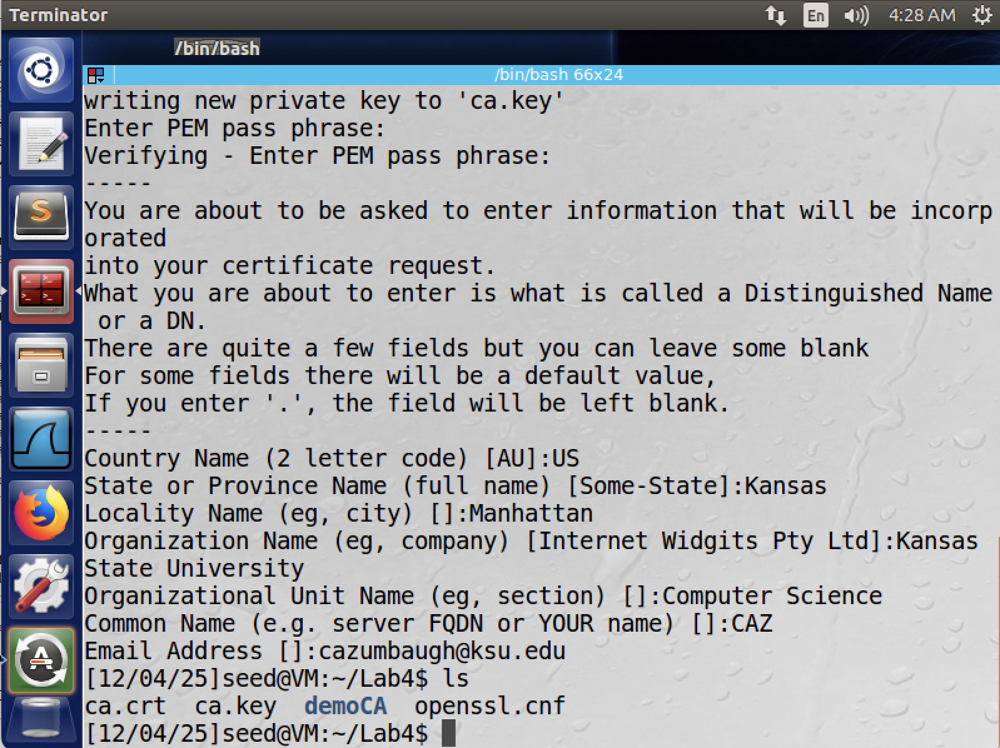
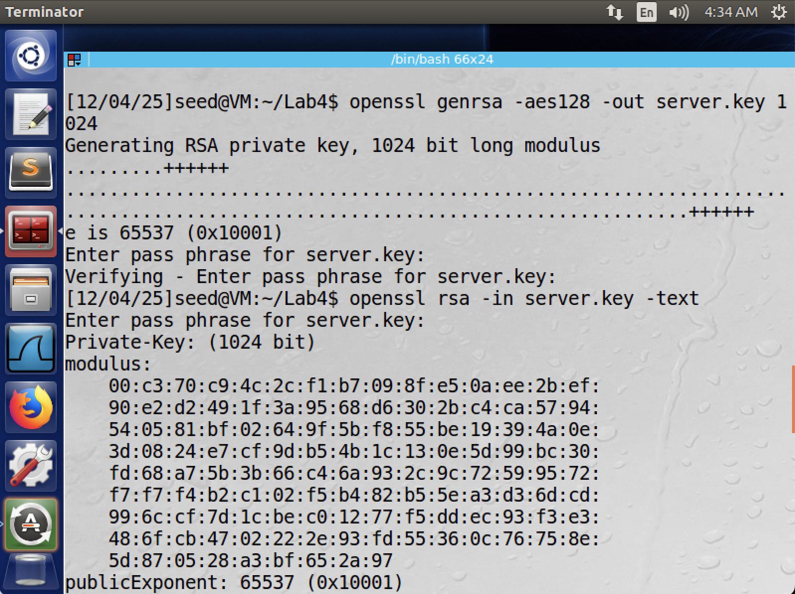
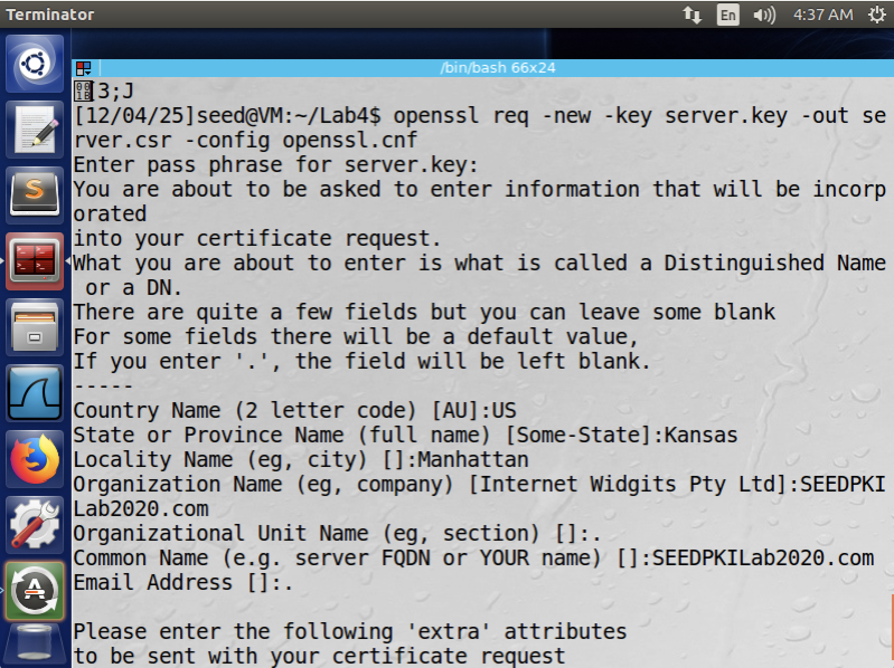
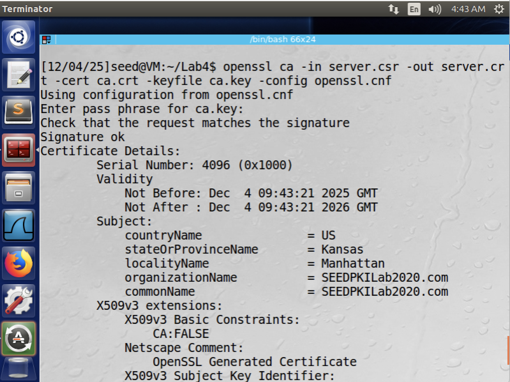

# CIS 751 Lab Assignment 4
### Author: Chuck Zumbaugh
### Collaborators: None

## Task 1
In this task we will become a certificate authority. The `openssl.conf` file was copied to the current directory and a `/demoCA` directory was created with an `index.txt` file. After this was done, a self-signed certificate was generated using the below command.

```sh
openssl req -new -x509 -keyout ca.key -out ca.crt -config openssl.conf
```

After completing the requested information, we have the certificate.



## Task 2
After becoming a root CA, we now sign a certificate for `SEEDPKILab2020.com`. The public/private keypair for this site was first generated as follows using the AES128 encryption algorithm:

```sh
openssl genrsa -aes128 -out server.key 1024
```
Using `openssl rsa -in server.key -text` we can view the contents of the `server.key` file.



Now that we have a private key, we can create a certificate signing request for the server, using `SEEDPKILab2020.com` as the common name of the certificate request.

```sh
openssl req -new -key server.key -out server.csr -config openssl.conf
```



Finally, we can generate the servers certificate from the CSR and the root certificate/key. Note that `openssl.conf` file needs to be modified to use `policy = policy_anything` as the organization names differ between the CA and server.

```sh
openssl ca -in server.csr -out server.crt -cert ca.crt -keyfile ca.key -config openssl.conf
```


## Task 3
In this task we will deploy the certificate in an HTTPS web server using openssl's built in web server. 