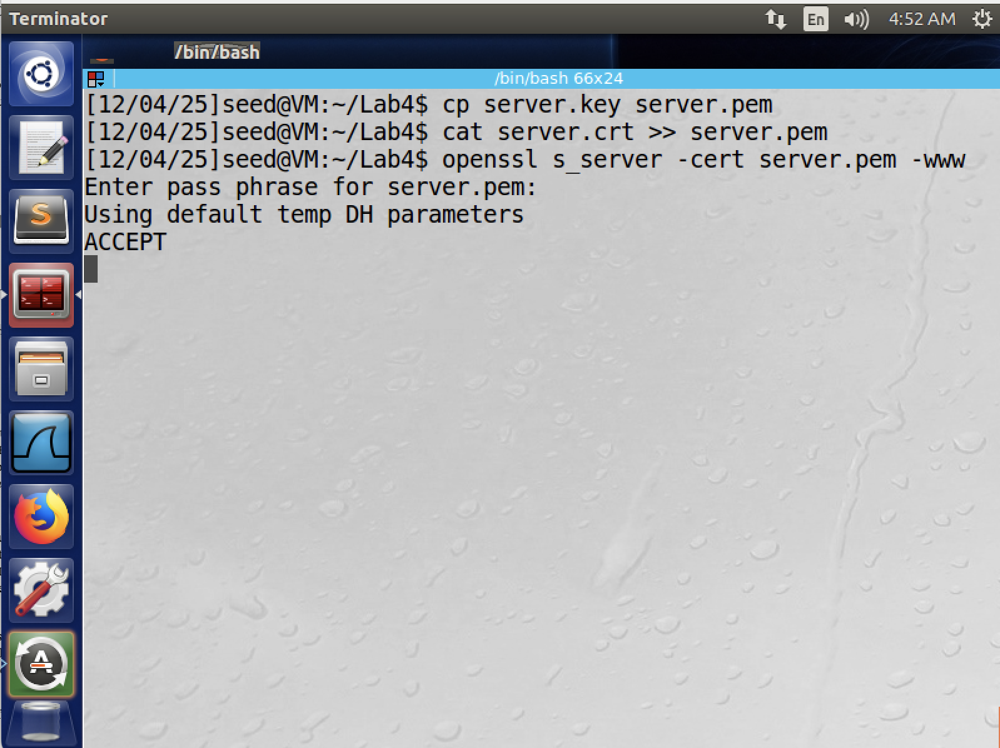
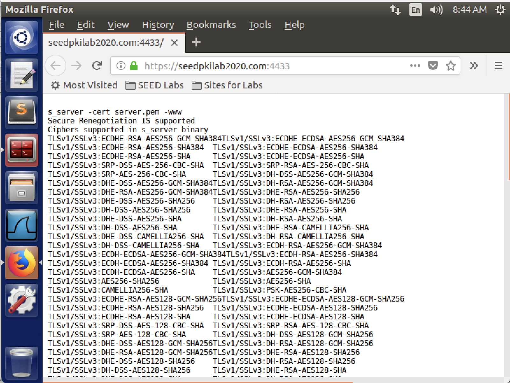
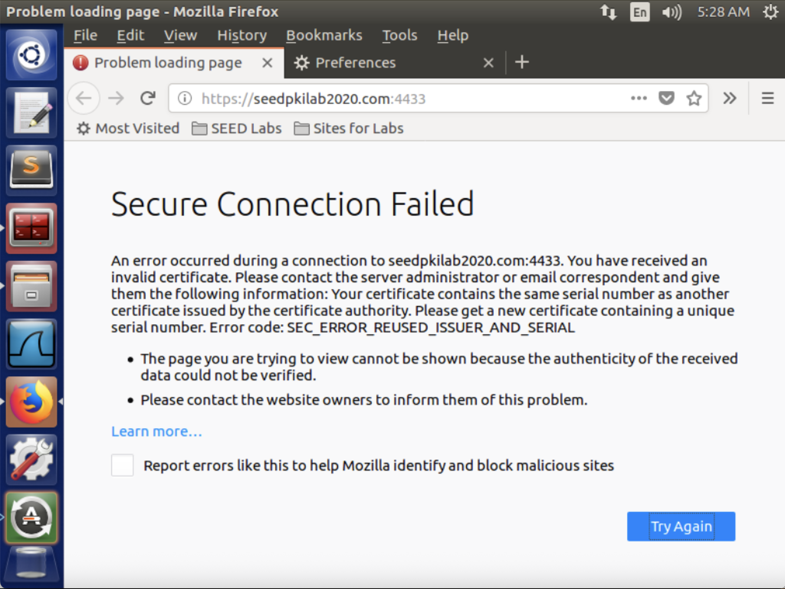
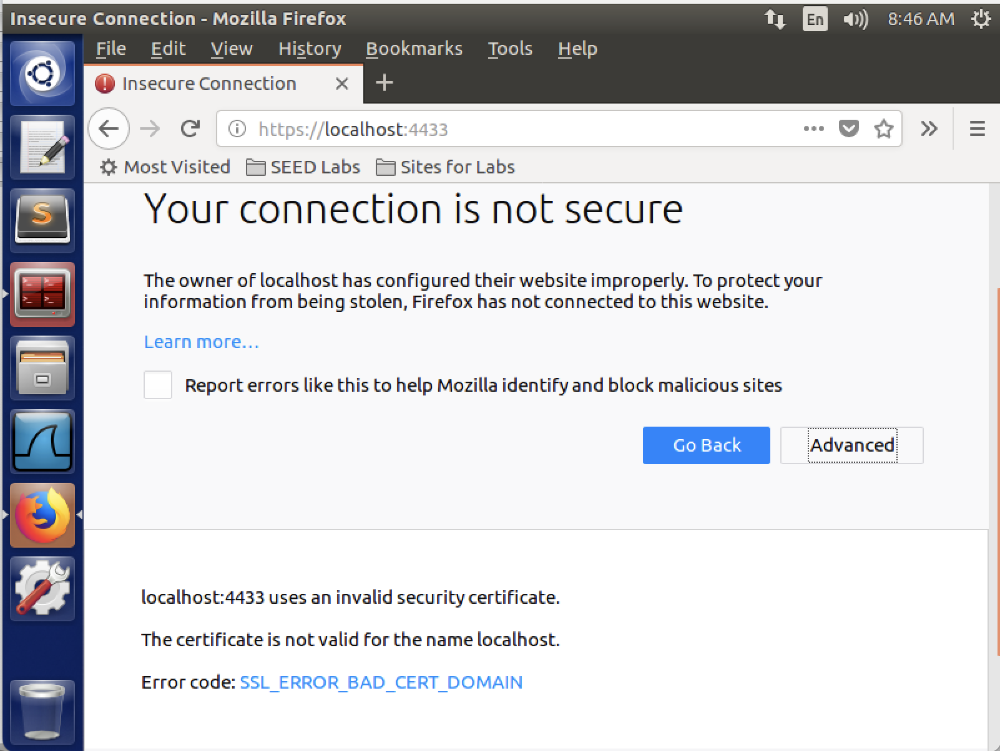
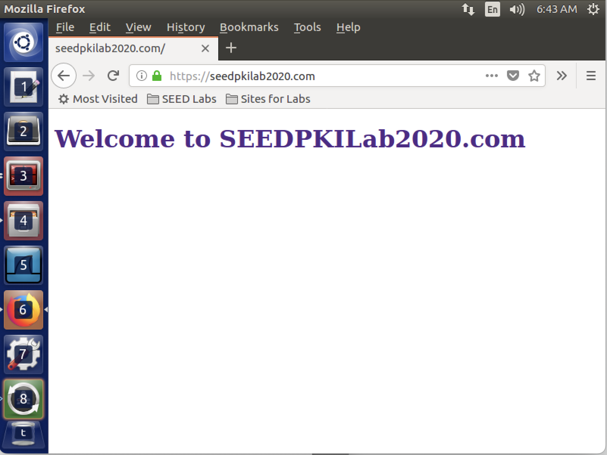
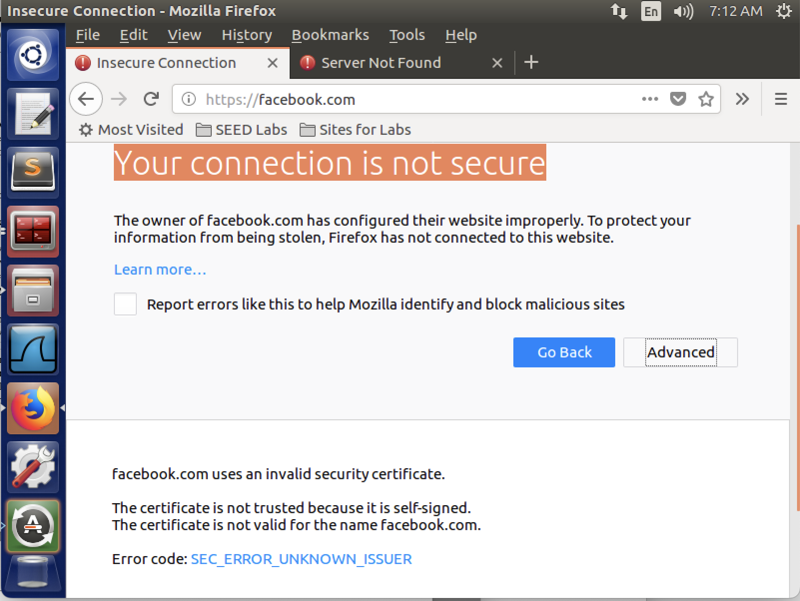
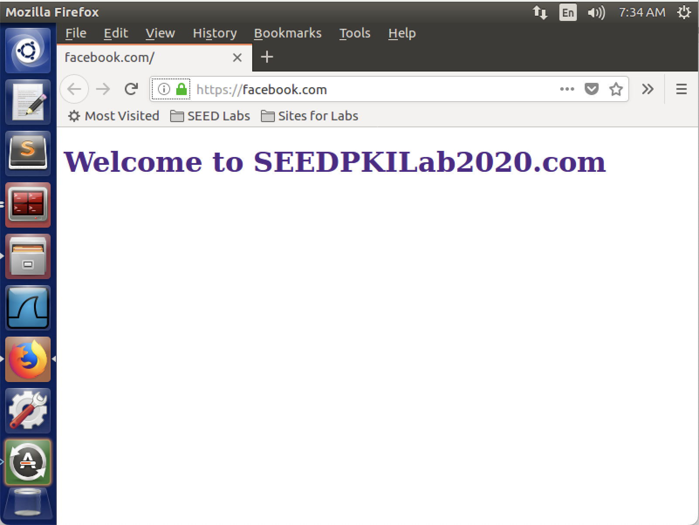

# CIS 751 Lab Assignment 4
### Author: Chuck Zumbaugh
### Collaborators: None

## Task 1
In this task we will become a certificate authority. The `openssl.conf` file was copied to the current directory and a `/demoCA` directory was created with an `index.txt` file. After this was done, a self-signed certificate was generated using the below command.

```sh
openssl req -new -x509 -keyout ca.key -out ca.crt -config openssl.conf
```

After completing the requested information, we have the certificate.


## Task 2
After becoming a root CA, we now sign a certificate for `SEEDPKILab2020.com`. The public/private keypair for this site was first generated as follows using the AES128 encryption algorithm:

```sh
openssl genrsa -aes128 -out server.key 1024
```
Using `openssl rsa -in server.key -text` we can view the contents of the `server.key` file.


Now that we have a private key, we can create a certificate signing request for the server, using `SEEDPKILab2020.com` as the common name of the certificate request.

```sh
openssl req -new -key server.key -out server.csr -config openssl.conf
```


Finally, we can generate the servers certificate from the CSR and the root certificate/key. Note that `openssl.conf` file needs to be modified to use `policy = policy_anything` as the organization names differ between the CA and server.

```sh
openssl ca -in server.csr -out server.crt -cert ca.crt -keyfile ca.key -config openssl.conf
```


## Task 3
In this task we will deploy the certificate in an HTTPS web server using openssl's built in web server. We first configure DNS to bind `SEEDPKILab2020.com` to `127.0.0.1` (localhost) by adding the following line to `/etc/hosts`:
```sh
127.0.0.1   SEEDPKILab2020.com
```

Once this is done, the certificate and private key can be combined into a single file and used to launch the server.



Initially, Firefox rejects the certificate because the CA is not recognized by Firefox. However, we can import our CA certificate into Firefox, after which, the site will provide some debug information regarding the session and certificate.




However, modifying the `.pem` file will prevent Firefox from establishing the connection. If the private key is modified (even by a single byte), openssl will not even start the server as the certificate and complains that the certificate is bad, or there was a bad decrypt. If we modify the certificate by a single byte, openssl will start the server, but Firefox will refuse to connect. Instead, we will see an error saying Firefox received an invalid certificate. This is the expected behavior, as we do not want a browser to connect to a website if the certificate has been tampered with.



Currently, SEEDPKILab2020.com is set up such that it is mapped to localhost. Thus, it stands to reason that we should arrive at the same page by navigating to `https://localhost:4433`. However, as shown in the below figure this is not the case. During registration, the certificate was created with the name "SEEDPKILab2020.com". When Firefox attempts to connect, it notices that the name of the site we are trying to connect to does not match the name on the certificate and generates a warning that the certificate is not valid for the name "localhost". We can bypass this by adding an exception in the browser, though this is a security feature and helps to protect us from visiting a malicious website.



## Task 4
We will now deploy our website using Apache. To do this, we must first update two Apache configuration files as shown below. The `000-default.conf` file is the configuration file for HTTP websites, while `default-ssl.conf` is the configuration file for HTTPS websites.
```xml
<!-- 000-default.conf -->
<VirtualHost>
    ServerName SeedPKILab2020.com
    DocumentRoot /var/www/seedpkilab2020
    DirectoryIndex index.html
</VirtualHost>

<!-- default-ssl.conf -->
<VirtualHost>
    ServerName SEEDPKILab2020.com
    DocumentRoot /var/www/seedpkilab2020
    DirectoryIndex index.html

    SSLEngine on
    SSLCertificateFile /home/seed/Lab4/server.crt
    SSLCertificateKeyFile /home/seed/Lab4/server.key
</VirtualHost>
```

With this configuration, Apache will look in the `/var/www/seedpkilab2020` directory for an `index.html` file to serve. Thus, we need to create the directory and add the following file.

``` html
<!-- index.html -->
<!DOCTYPE html>
<html>
    <body>
        <h1 style="color: #512888;">Welcome to SEEDPKILab2020.com</h1>
    </body>
</html>
```

The `SSLCertificateFile` and `SSLCertificateKeyFile` specify where the server's certificate and private key is located. Thus, they are pointed at the location they were placed when created in Task 2. Once this is done, we run the following commands to enable SSL.

```
// Test the Apache configuration file for errors
$ sudo apachectl configtest

// Enable the SSL module
$ sudo a2enmod ssl

// Enable the site
$ sido a2ensite default-ssl

// Restart Apache
$ sudo service apache2 restart
```

Now when we visit `https://SEEDPKILab2020.com` we get the following page, indicating the Apache server is correctly configured.


## Task 5
Now that the site is up and running, we will simulate a man-in-the-middle attack on `facebook.com`. We must first set up the Apache server to impersonate `facebook.com` by adding the following to the default SSL configuration file.

```xml
<VirtualHost>
    ServerName facebook.com <!-- Impersonate facebook.com -->
    DocumentRoot /var/www/seedpkilab2020
    DirectoryIndex index.html

    SSLEngine on
    SSLCertificateFile /home/seed/Lab4/server.crt
    SSLCertificateKeyFile /home/seed/Lab4/server.key
</VirtualHost>
```

Now that our server is configured to impersonate Facebook, we must now become the man in the middle by simulating a DNS cache poisoning attack. To do this, the following line is added to `/etc/hosts`.
```
127.0.0.1   facebook.com
```
Once this is added, the user will be pointed to our IP address (127.0.0.1) when they access `facebook.com`. However, when we attempt to access it, we receive the below warning from Firefox indicating that the certificate is not valid. Specifically, this indicates that the name is invalid. This is not surprising, as we are using the certificate generated for `SEEDPKILab2020.com`, which is certainly not `facebook.com`. Thus, the certificate validation has successfully prevented our man-in-the-middle attack from succeeding (assuming the user does not navigate to the site anyway).



However, if the CA's private key is compromised, the attacker can generate an arbitrary certificate and cause this attack to succeed. We can simulate this by generating a new CSR and certificate for the server, but changing the name to `facebook.com`.
```sh
```

We also need to point our server to the new certificate that has the name `facebook.com`.
```xml
<VirtualHost>
    <!-- ... -->
    <!-- Point this at the illegitimately generated cert -->
    SSLCertificateFile /home/seed/Lab4/facebookCa/server.crt
    <!-- ... -->
</VirtualHost>
```

Once this is done, we now see the following page when we visit `https://facebook.com`. As is clear in the image below, the browser has no issue connecting with our server when we visit Facebook. Although the IP address it received from the DNS is clearly not Facebook, it receives a certificate that appears to be from Facebook and is signed by a trusted CA.



