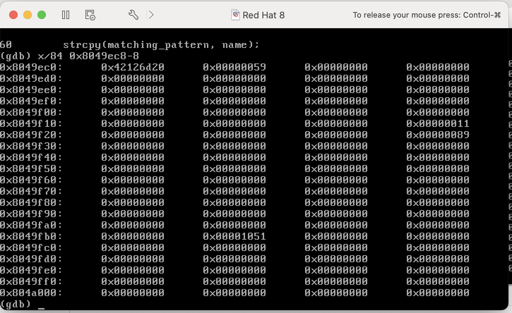
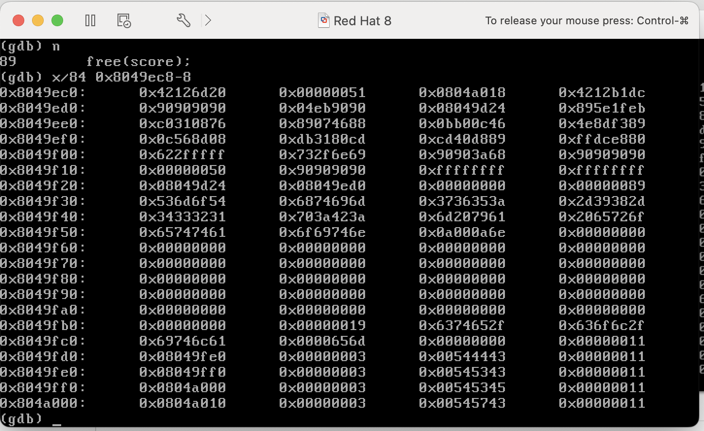

# Assignment 3 Documentation
### Written By: Chuck Zumbaugh
### Collaborators: None

## Running the exploit
There are two files included, a `build_exploit.c` file that contains the source code and a compiled binary, `build_exploit`. When run, the compiled binary will generate the two inputs required by `getscore_heap` and spawn a new shell that contains the shell variables `NAME` and `SSN`. To run the exploit, simply build the shell variables and pass them to the program as follows:
```sh
$ ./build_exploit                   # Builds the shell variables NAME and SSN
$ ./getscore_heap $NAME $SSN        # Run the program with the generated inputs
```

The exploit builder can be compiled from the source if needed using GCC:
```sh
gcc -o build_exploit build_exploit.c
```

## Overview and objective
The objective is to exploit a buffer overflow vulnerability in the `getscore_heap` program and get the program to return a shell. This program accepts two pieces of user input, a name and a SSN, that are then used to look up data in a `score.txt` file and return the matching data. To do this, it allocates 3 character buffers on the heap: `matching_pattern`, `score`, and `line` (in that order). While the size of `score` and `line` are fixed (10 and 120 bytes, respectively), the size of `matching_pattern` is the length of the `name` argument + 17. The `matching_pattern` is used to store the text pattern to search for, and is built as follows:
```c
...

// The length of the buffer is determined by the name argument
if ((matching_pattern = (char *) malloc(strlen(name) + 17)) == NULL) {
    printf("Failed to allocate memory.\n");
    exit(-1);
}

...

strcpy(matching_pattern, name); 
strcat(matching_pattern, ":"); // strlen(name) + 1 bytes used
strcat(matching_pattern, ssn); // We can cause an overflow here by passing > 16 bytes
```

Clearly, there is a vulnerability in that the buffer size is determined solely by name and there is no check that `ssn` will fit in the remaining 16 bytes. After constructing `matching_pattern`, the score file is scanned anc checked against the input as follows:
```c
// line is mutated with each iteration
while (fgets(line, 120, scorefile) != NULL) {
    if (match_point = str_prefix(matching_pattern, line)) {
        // ... 
        // Code not reached assuming str_prefix returns NULL
    }
}
```

After reading through the file the program reaches the end where these variables are freed as follows:
```c
free(matching_pattern);
free(score);
free(line);
```

Clearly we can exploit this using an unlink based attack, but we need to ensure the payload is not modified by the program prior to `free()` being called. When there are no matches in the file, which we can safely assume if we are passing an exploit, the `matching_pattern` and `score` data are not changed. However, `line` is mutated during the `while` loop above so the entire payload must be contained within `matching_pattern` and `score`. This is not a problem since we can make `matching_payload` whatever size we need through the `name` argument and use `score` to setup a fake heap structure. The overall strategy will be to use the `name` input to contain the NOP sled and shellcode and use the `SSN` input to fill the remaining portion of the buffer, and overwrite the `score` buffer to create a fake heap structure that will cause an unlink to occur when `free(matching_pattern)` is called.

## Finding the relevant addresses
### Address of `free`
Since `malloc` and `free` are part of the C standard library, the assembly instructions will contain stubs to these functions that will be resolved at runtime by the dynamic linker. Specifically, this stub is the address of the entry in the PLT, which will either return the address from the GOT if it has been previously used, or call the resolver to retrieve the address. For this exploit, we are interested in modifying the address of `free` in the GOT table to point to our payload. This location of GOT entries can be retrieved using
```sh
$ objdump -R getscore_heap
``` 
Which shows the following for `free`:
```sh
# ...
# 08049d30 R_386_JUMP_SLOT free
```

Thus, the address we need to use in the forward pointer is `0x08048D24`.

### Address of `matching_pattern`
The `getscore_heap` program will print out the address of `matching_pattern`, `score`, and `line` when run, so we can get the address of `matching_pattern` by simply running it with junk input:
```sh
./getscore_heap aaa aaa

# Address of matching_pattern : 0x8049ec8
```

Most programs won't do this though, and in such cases we can use GDB to find the address of variables. To do this, we can set a breakpoint at some point in the program after `matching_pattern` has been allocated. By running `x &matching_pattern`, we will get the location on the stack that contains the address of `matching_pattern`.

## Determining the length of the buffer
Since we have access to the source code, it is quite trivial to determine the length of the buffer. The program allocates `strlen(name) + 17` bytes, so we need to know the length of the input. As previously mentioned, the `name` argument must contain the exploit prefix, the `jmp 0x6` instruction, the overwrite (what will be replaced by the GOT address), and the shellcode. The below table contains the size of each component.

|  Component      | Size (bytes)       |
| :-------------: | :----------------: |
| Prefix          | 8                  |
| NOP JMP         | 8                  |
| Overwrite       | 4                  |
| Shellcode       | 45                 |
| **Total**       | **65**             |

Since chunks are allocated in increments of 8 bytes, the chunk will have a total of 88 bytes (`ceil((65 + 17) / 8) * 8`), including 8 bytes of metadata at the beginning. Then we need a total of `88 - 8 - 65 = 15` bytes of additional input to fill the buffer. The character `:` is concatenated, so we need 14 bytes at the beginning of `SSN` to fill the buffer. 

## Building the exploit
The name argument is generated as follows, where `+` indicates concatenation:
```
NAME = Prefix + NOP_JMP + Overwrite + Shellcode
```

As mentioned in the previous section, we need an additional 14 bytes to fill the buffer, and for that we shall use NOPs. The size of the next chunk is 16 bytes (10 declared, but allocated in blocks of 8), so we need to overwrite the initial 8 bytes of metadata with `0xFFFFFFFF`, place the GOT address - 12, followed by the address of `jmp 0x6` - 6. Thus the `SSN` input is composed as follows:

| Component | Data |
| :------:  | ---- |
| NOP_FILL | `\x90` * 14 |
| SIZE    | `\xFF\xFF\xFF\xFF\xFF\xFF\xFF\xFF` |
| GOT_ADDR | `\x24\x9d\x04\x08` |
| RET_ADDR | `\xd0\x93\x04\x08` |

```
SSN = NOP_FILL + SIZE + GOT_ADDR + RET_ADDR
```

With the `SSN` portion, we are creating a fake heap chunk underneath the `matching_pattern` buffer that is freed. This way, when `free(matching_pattern)` is called the system thinks it needs to unlink `score` and consolidate it with `matching_pattern`. Since we are setting what would be the forward pointer to the GOT address - 12 and the reverse pointer to our shellcode, this will cause the GOT entry of `free` to be overwritten with the address to our shellcode. When `free(matching_pattern)` is called, `free` will looked up and the computer will begin to execute our shellcode. 

## Executing the attack
To provide a detailed overview of how the attack works we will examine the heap throughout execution. Figure 1 shows the state of the region of interest following allocation, but before any data has been copied to memory. The size of the first buffer is listed as `0x59`, which is 89. Since the last bit is used to indicate if the previous chunk is in use, the size of this chunk is 88 as expected. The size of the next chunk (score) is `0x11`, or 17, which is 16 bytes as expected.



Figure 2 shows the state after both `name` and `SSN` have been copied to the buffer and the overflow has occurred. The first 2 machine words following the metadata are NOPs that will be overwritten with forward and reverse pointers when this chunk is linked. We then have a small NOP slide and the `jmp 0x6` instruction, followed by the shellcode. The `3A` byte near `0x8049f0C` indicates the ":" character that splits the `name` and `SSN` inputs. This is followed by 14 NOPs to reach the end of the `name` buffer. The first 2 words of the next chunk are set to `0xFFFFFFFF`, the next word is set to the GOT address - 12, and the following word is the address we wish to return to.


Figure 3 shows the state just prior to `free(matching_pattern)`. This is quite similar to Figure 2, except the data in the `line` buffer has been modified.


Figure 4 shows the state just after `free(matching_pattern)` has been called. There are a few key changes to note. As mentioned above, the first 8 bytes of NOPs have been overwritten with the forward and reverse pointers for the freed list. Additionally, the word at `0x8049edc` has been changed from the overwrite (`0x5a5a5a5a`) to the address to the GOT entry (`0x08049d24`).



At this point, we should get a shell since we expect the address at the GOT entry for free to have been replaced with the address to our payload. As shown below, this is what happens when we run this outside of GDB.

